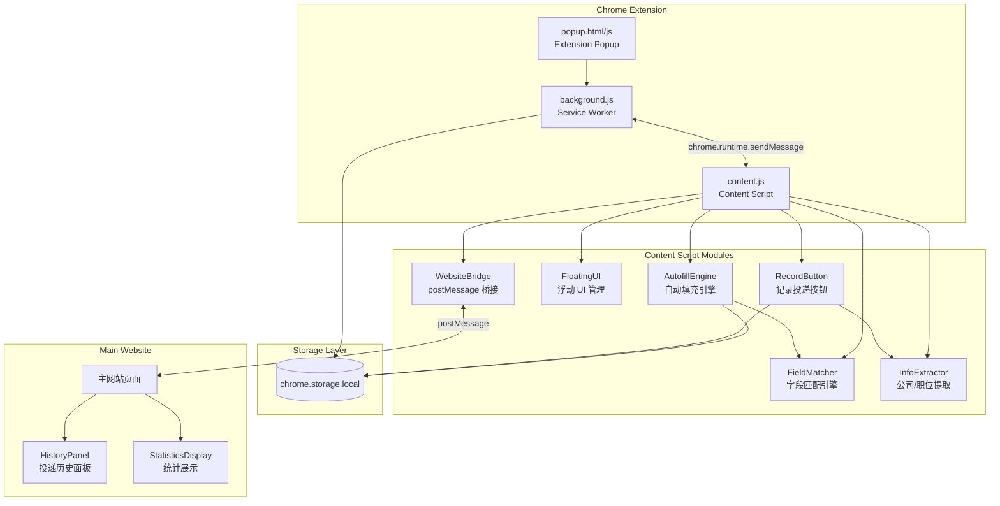

# Design Document: Autofill and Tracking

## Overview

本设计文档描述"通用自动填充与投递追踪"功能的技术架构。该功能增强现有 Chrome 扩展（Manifest V3），实现两个核心能力：

1. **通用自动填充**：在任意网页上通过智能字段匹配将简历数据填入表单
2. **投递记录追踪**：记录每次投递信息，通过 postMessage 桥接在主网站展示时间线和统计

技术栈：Chrome Extension Manifest V3、content.js（注入所有页面）、background.js（Service Worker）、chrome.storage.local（持久化）、postMessage 通信桥接模式。无需后端。

## Architecture



### 设计决策

1. **模块化 Content Script**：将现有单文件 content.js 拆分为多个逻辑模块（FieldMatcher、AutofillEngine、FloatingUI 等），通过 webpack 打包为单个输出文件。
2. **postMessage 桥接复用**：复用现有 `RESUME_EXT_MSG` / `RESUME_EXT_RESPONSE` 消息格式，新增 action 类型支持投递记录 CRUD。
3. **chrome.storage.local 存储**：所有投递记录存储在 `applicationRecords` key 下，与现有 `resume` key 并存。
4. **浮动 UI Shadow DOM**：使用 Shadow DOM 隔离浮动按钮和确认面板的样式，避免与宿主页面 CSS 冲突。
5. **事件触发兼容**：填充后触发 input/change/blur 事件确保目标网站表单验证正常工作。

## Components and Interfaces

### 1. FieldMatcher（字段匹配器）

```typescript
interface FieldMatchResult {
  element: HTMLInputElement | HTMLTextAreaElement | HTMLSelectElement;
  fieldCategory: FieldCategory;
  confidence: number;  // 0-100
  matchedAttribute: 'label' | 'aria-label' | 'placeholder' | 'name' | 'id';
}

type FieldCategory = 
  | 'name' | 'phone' | 'email' 
  | 'education' | 'major' | 'degree' | 'graduationDate'
  | 'workExperience' | 'company' | 'position' 
  | 'skills' | 'introduction';

interface FieldMatcher {
  /**
   * 分析页面中所有表单元素，返回匹配结果
   * 置信度低于 60% 的字段不包含在结果中
   */
  analyzeFormFields(root?: HTMLElement): FieldMatchResult[];

  /**
   * 对单个元素进行字段匹配
   */
  matchField(element: HTMLElement): FieldMatchResult | null;
}
```

**匹配优先级**（从高到低）：
1. 关联 label 文本（`<label for="...">` 或父级 `<label>`）
2. `aria-label` 属性
3. `placeholder` 属性
4. `name` 属性
5. `id` 属性

**关键词库**（中英双语）：
- name: `['name', '姓名', '名字', 'fullname', 'full_name', '真实姓名']`
- phone: `['phone', 'tel', 'mobile', '电话', '手机', '联系电话', '手机号']`
- email: `['email', 'mail', '邮箱', '电子邮件', '邮件地址']`
- 等等...

### 2. AutofillEngine（自动填充引擎）

```typescript
interface FillResult {
  filled: Array<{ fieldName: string; value: string; element: HTMLElement }>;
  skipped: Array<{ fieldName: string; reason: string; element: HTMLElement }>;
}

interface AutofillEngine {
  /**
   * 执行自动填充，返回填充结果
   */
  fill(resumeData: ResumeJSON): Promise<FillResult>;

  /**
   * 撤销上一次填充操作
   */
  undo(): void;
}
```

填充逻辑：
- 文本输入：设置 `value` 后触发 `input`、`change`、`blur` 事件
- Select 下拉框：模糊匹配选项文本，设置后触发 `change` 事件
- 尊重 `maxlength` 约束，自动截断
- 保存填充前的原始值用于撤销

### 3. FloatingUI（浮动 UI 管理）

```typescript
interface FloatingUI {
  /**
   * 显示自动填充触发按钮
   */
  showAutofillTrigger(): void;

  /**
   * 隐藏自动填充触发按钮
   */
  hideAutofillTrigger(): void;

  /**
   * 显示填充确认面板
   */
  showConfirmation(result: FillResult): void;

  /**
   * 显示记录投递按钮
   */
  showRecordButton(): void;

  /**
   * 显示通知消息
   */
  showNotification(message: string, type: 'success' | 'error' | 'info'): void;
}
```

实现要点：
- 使用 Shadow DOM 创建隔离的 UI 容器
- z-index 设为 `2147483647`（最大值）确保始终可见
- 浮动按钮支持拖拽（mousedown/mousemove/mouseup）
- MutationObserver 监听 DOM 变化，动态显示/隐藏触发按钮
- 确认面板 10 秒自动消失

### 4. RecordButton & InfoExtractor（记录投递 & 信息提取）

```typescript
interface ApplicationRecord {
  id: string;           // UUID
  date: string;         // ISO 8601 timestamp
  url: string;          // 当前页面 URL
  pageTitle: string;    // document.title
  company: string;      // 提取的公司名
  position: string;     // 提取的职位名
  status: ApplicationStatus;
}

type ApplicationStatus = '已投递' | '待面试' | '已面试' | '已录用' | '已拒绝';

interface InfoExtractor {
  /**
   * 从页面中提取公司名称
   * 优先级：页面标题 > heading 元素 > URL domain
   */
  extractCompany(): string;

  /**
   * 从页面中提取职位名称
   * 优先级：页面标题 > 表单标题 > 职位描述元素
   */
  extractPosition(): string;
}
```

提取策略：
- 公司名：分析 `document.title`（常见格式 "职位 - 公司"）、`<h1>`/`<h2>` 元素、URL domain
- 职位名：分析 `document.title`、表单附近的 heading、含有"岗位"/"职位"关键词的元素
- 提取失败时使用 URL domain / page title 作为 fallback

### 5. WebsiteBridge（网站通信桥接）

```typescript
interface BridgeMessage {
  type: 'RESUME_EXT_MSG';
  requestId: string;
  payload: {
    action: 'getApplicationRecords' | 'updateApplicationRecord' | 'deleteApplicationRecord';
    data?: Partial<ApplicationRecord>;
    id?: string;
  };
}

interface BridgeResponse {
  type: 'RESUME_EXT_RESPONSE';
  requestId: string;
  response: {
    success: boolean;
    data?: ApplicationRecord[];
    message?: string;
  };
}
```

通信流程：
1. 网站发送 `postMessage({ type: 'RESUME_EXT_MSG', ... })`
2. Content Script 监听 `message` 事件，验证来源
3. Content Script 操作 chrome.storage.local
4. Content Script 回复 `postMessage({ type: 'RESUME_EXT_RESPONSE', ... })`

来源验证：检查 `event.origin` 是否在 manifest `externally_connectable.matches` 配置的域名列表中。

### 6. HistoryPanel & StatisticsDisplay（网站端 UI）

```typescript
interface HistoryPanelProps {
  records: ApplicationRecord[];
  onStatusChange: (id: string, status: ApplicationStatus) => void;
  onDelete: (id: string) => void;
  onEdit: (id: string, updates: Partial<ApplicationRecord>) => void;
}

interface StatisticsData {
  total: number;
  byStatus: Record<ApplicationStatus, number>;
  byCompany: Record<string, number>;
  last30Days: Array<{ date: string; count: number }>;
}
```

网站端实现：
- 纯 HTML/CSS/JS（与现有主网站技术栈一致）
- 樱花粉配色方案（`--sakura-primary: #FFB7C5`）
- 时间线垂直布局，按日期降序排列
- 内联编辑表单（可编辑：company、position、status、pageTitle）
- 统计面板：总数、按状态分组、按公司分组、近 30 天分布

## Data Models

### ApplicationRecord 存储结构

```typescript
// chrome.storage.local key: "applicationRecords"
interface StorageSchema {
  applicationRecords: ApplicationRecord[];
  resume: ResumeJSON;  // 现有简历数据
}

interface ApplicationRecord {
  id: string;           // crypto.randomUUID() 生成
  date: string;         // new Date().toISOString()
  url: string;          // window.location.href
  pageTitle: string;    // document.title
  company: string;      // 提取或用户确认的公司名
  position: string;     // 提取或用户确认的职位名
  status: ApplicationStatus;
}
```

### 存储操作

```typescript
// 读取所有记录
async function getRecords(): Promise<ApplicationRecord[]> {
  const { applicationRecords = [] } = await chrome.storage.local.get('applicationRecords');
  return applicationRecords.sort((a, b) => 
    new Date(b.date).getTime() - new Date(a.date).getTime()
  );
}

// 添加记录（追加，不覆盖）
async function addRecord(record: ApplicationRecord): Promise<void> {
  const records = await getRecords();
  records.push(record);
  await chrome.storage.local.set({ applicationRecords: records });
}

// 更新记录（仅修改指定字段）
async function updateRecord(id: string, updates: Partial<ApplicationRecord>): Promise<void> {
  const records = await getRecords();
  const index = records.findIndex(r => r.id === id);
  if (index !== -1) {
    records[index] = { ...records[index], ...updates, id: records[index].id };
    await chrome.storage.local.set({ applicationRecords: records });
  }
}

// 删除记录
async function deleteRecord(id: string): Promise<void> {
  const records = await getRecords();
  const filtered = records.filter(r => r.id !== id);
  await chrome.storage.local.set({ applicationRecords: filtered });
}
```

### 容量设计

- chrome.storage.local 限制：5MB（扩展默认）或 `unlimitedStorage` 权限可扩展
- 单条 ApplicationRecord 约 200-500 bytes
- 500 条记录约 250KB，远低于限制
- 无需分页或清理策略

## Correctness Properties

*A property is a characteristic or behavior that should hold true across all valid executions of a system—essentially, a formal statement about what the system should do. Properties serve as the bridge between human-readable specifications and machine-verifiable correctness guarantees.*

### Property 1: Trigger visibility equals form presence

*For any* web page DOM state, the Autofill_Trigger should be visible if and only if the page contains at least one form input element (input, textarea, or select).

**Validates: Requirements 1.1, 1.2**

### Property 2: Field matching correctness

*For any* input element with a name/id/placeholder/aria-label/label containing a keyword (Chinese or English) from a supported field category, the FieldMatcher shall return the correct field category with confidence ≥ 60%.

**Validates: Requirements 2.1, 2.3**

### Property 3: Attribute priority ordering

*For any* input element where different attributes (label, aria-label, placeholder, name, id) suggest different field categories, the FieldMatcher shall return the category indicated by the highest-priority attribute (label > aria-label > placeholder > name > id).

**Validates: Requirements 2.4**

### Property 4: Low-confidence fields excluded

*For any* input element whose attributes do not contain any recognized keyword (producing confidence < 60%), the FieldMatcher shall not include that element in the match results.

**Validates: Requirements 2.5**

### Property 5: Select option closest match

*For any* select element with a set of options and a target resume value, the AutofillEngine shall select the option whose text is the closest match to the resume value.

**Validates: Requirements 2.6**

### Property 6: Maxlength invariant

*For any* input element with a maxlength attribute and any fill value string, the value actually set on the element shall have length ≤ maxlength.

**Validates: Requirements 2.7**

### Property 7: Fill-undo round trip

*For any* form state, performing autofill followed by undo shall restore all fields to their original values before the fill operation.

**Validates: Requirements 3.3**

### Property 8: Events dispatched on fill

*For any* form field that is filled by the AutofillEngine, the engine shall dispatch input, change, and blur events on that element.

**Validates: Requirements 3.5, 3.6**

### Property 9: Error resilience - partial fill continues

*For any* set of form fields where some fields throw errors during fill, the AutofillEngine shall still successfully fill all non-erroring fields and report erroring fields as skipped.

**Validates: Requirements 3.7**

### Property 10: Record structural completeness

*For any* newly created ApplicationRecord, it shall contain all required fields (id, date, url, pageTitle, company, position, status) with correct types, and the initial status shall be "已投递".

**Validates: Requirements 5.1, 5.3**

### Property 11: Unique ID generation

*For any* N ApplicationRecords created in sequence, all generated IDs shall be distinct from each other.

**Validates: Requirements 5.2**

### Property 12: Append preserves existing records

*For any* existing array of ApplicationRecords and a new record to add, after the add operation, all previously existing records shall still be present unchanged, and the new record shall also be present.

**Validates: Requirements 5.5**

### Property 13: Partial update preserves unmodified fields

*For any* ApplicationRecord and any partial update (subset of fields), after the update operation, all fields not included in the update shall retain their original values. The date and url fields shall never be modifiable.

**Validates: Requirements 5.7, 10.3**

### Property 14: Extraction always returns non-empty

*For any* web page with a valid URL and document title, the InfoExtractor shall always return a non-empty string for both company and position (using URL domain and page title as fallbacks respectively).

**Validates: Requirements 6.1, 6.2, 6.3, 6.4**

### Property 15: Origin validation

*For any* postMessage event, the WebsiteBridge shall only process messages whose origin matches one of the authorized domains defined in the manifest externally_connectable configuration. Messages from unauthorized origins shall be ignored.

**Validates: Requirements 7.4**

### Property 16: Records sorted by date descending

*For any* array of ApplicationRecords with arbitrary dates, when retrieved via getRecords(), the returned array shall be sorted by date in descending order (most recent first).

**Validates: Requirements 7.5**

### Property 17: Statistics group sums equal total

*For any* array of ApplicationRecords, the sum of counts in the by-status grouping shall equal the total count, and the sum of counts in the by-company grouping shall equal the total count.

**Validates: Requirements 9.1, 9.2, 9.3**

### Property 18: 30-day distribution correctness

*For any* array of ApplicationRecords with arbitrary dates, the sum of the 30-day distribution counts shall equal the number of records whose date falls within the last 30 days.

**Validates: Requirements 9.4**

## Error Handling

### Content Script Errors

| 场景 | 处理策略 |
|------|----------|
| chrome.storage.local 读取失败 | 显示错误通知，不执行填充 |
| 简历数据格式异常 | 显示"简历数据损坏"通知，建议重新上传 |
| 单个字段填充异常 | 跳过该字段，继续填充其他字段，在确认面板中报告 |
| DOM 元素在填充过程中被移除 | 捕获异常，跳过该字段 |
| postMessage 来源验证失败 | 静默忽略消息，不响应 |
| 存储写入失败（容量满） | 显示错误通知，建议清理旧记录 |
| 信息提取失败 | 使用 fallback 值（domain / page title） |

### Website Bridge Errors

| 场景 | 处理策略 |
|------|----------|
| 扩展未安装/未启用 | 网站显示安装提示，3 秒超时检测 |
| 通信超时（5 秒无响应） | 显示"扩展无响应"错误，建议刷新页面 |
| 更新/删除操作失败 | 显示错误通知，恢复 UI 到操作前状态 |
| 数据格式不匹配 | 记录错误日志，显示通用错误消息 |

### 错误恢复策略

- **自动填充撤销**：保存填充前的原始值快照，支持一键恢复
- **乐观更新回滚**：网站端先更新 UI，若后端操作失败则回滚到之前状态
- **重试机制**：postMessage 通信失败时自动重试一次（1 秒延迟）

## Testing Strategy

### 测试框架

- **单元测试**：Jest + jsdom（已配置在 extension/package.json）
- **属性测试**：fast-check（已安装，版本 ^3.15.0）
- **E2E 测试**：Playwright（已配置）

### 属性测试（Property-Based Testing）

使用 fast-check 库实现上述 18 个正确性属性。每个属性测试运行最少 100 次迭代。

**测试文件组织**：
```
extension/src/
├── autofill/
│   ├── FieldMatcher.ts
│   ├── FieldMatcher.property.test.ts    # Properties 2, 3, 4, 5, 6
│   ├── AutofillEngine.ts
│   ├── AutofillEngine.property.test.ts  # Properties 7, 8, 9
│   └── FloatingUI.ts
├── tracking/
│   ├── ApplicationStorage.ts
│   ├── ApplicationStorage.property.test.ts  # Properties 10, 11, 12, 13, 16
│   ├── InfoExtractor.ts
│   ├── InfoExtractor.property.test.ts       # Property 14
│   ├── WebsiteBridge.ts
│   ├── WebsiteBridge.property.test.ts       # Property 15
│   └── Statistics.ts
│   └── Statistics.property.test.ts          # Properties 17, 18
└── content/
    ├── TriggerDetector.ts
    └── TriggerDetector.property.test.ts     # Property 1
```

**标签格式**：每个属性测试用注释标注对应的设计属性：
```typescript
// Feature: autofill-and-tracking, Property 1: Trigger visibility equals form presence
```

**配置**：
```typescript
fc.assert(fc.property(...), { numRuns: 100 });
```

### 单元测试

- 每个模块的具体行为示例
- 边界条件（空表单、无简历数据、存储满）
- 错误处理路径
- UI 状态转换

### 集成测试

- Content Script ↔ chrome.storage.local 交互
- Website ↔ Content Script postMessage 通信
- 完整的填充 → 记录 → 查看流程

### E2E 测试

- 使用 Playwright 在真实浏览器中测试扩展
- 测试表单填充在不同网站结构上的兼容性
- 测试投递记录的完整生命周期

