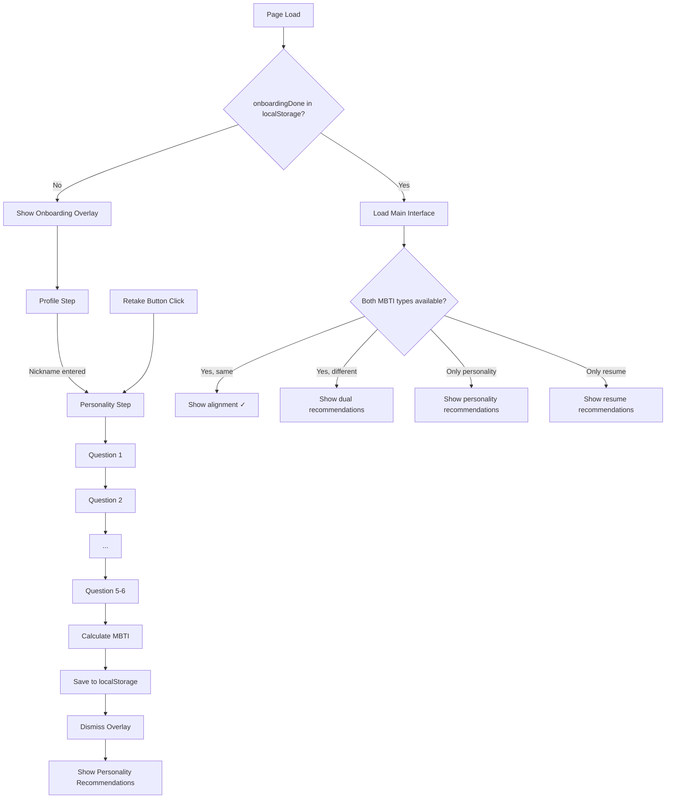
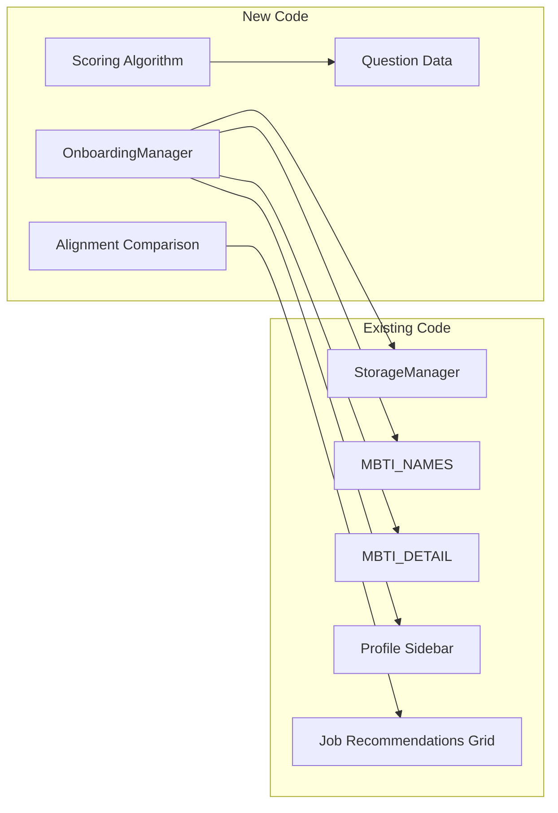

# Design Document: Cold-Start Onboarding

## Overview

The cold-start onboarding feature provides a guided first-time user experience for the 小小求职拿下 career guidance website. When a new user visits, a full-screen overlay walks them through two steps: (1) profile setup (avatar + nickname) and (2) personality preference questions. The answers are scored to infer an MBTI personality type, which drives initial job recommendations before any resume is uploaded.

The feature is implemented entirely in vanilla JavaScript within the existing single `index.html` file, using the existing `StorageManager` class for persistence and the existing `MBTI_NAMES`/`MBTI_DETAIL` objects for personality data display.

### Key Design Decisions

1. **Single-file integration**: All HTML, CSS, and JS are added to `index.html` to match the existing architecture (no build tools, no modules).
2. **Class-based encapsulation**: An `OnboardingManager` class encapsulates all onboarding logic, following the pattern of the existing `StorageManager`.
3. **Separate storage keys**: `personalityMBTI` and `personalityAnswers` are stored independently from resume-derived MBTI data, enabling dual-track comparison.
4. **Progressive disclosure**: Questions are shown one at a time with transitions, keeping cognitive load low for the college student audience.
5. **Retake without profile**: The retake flow skips the profile step since user identity is already established.

## Architecture



### Integration Points



## Components and Interfaces

### OnboardingManager Class

```javascript
class OnboardingManager {
  // Configuration
  static STORAGE_KEYS = {
    ONBOARDING_DONE: 'onboardingDone',
    PERSONALITY_MBTI: 'personalityMBTI',
    PERSONALITY_ANSWERS: 'personalityAnswers'
  };

  constructor() {
    this.currentStep = 'profile'; // 'profile' | 'personality'
    this.currentQuestionIndex = 0;
    this.answers = [];            // Array of { questionId, selectedOption, dimension, weight }
    this.isRetake = false;
    this.overlay = null;
  }

  // Lifecycle
  init()                    // Check flag, show overlay if needed
  destroy()                 // Clean up event listeners, remove overlay

  // Steps
  showProfileStep()         // Render avatar + nickname UI
  showPersonalityStep()     // Render first question card
  advanceQuestion(answer)   // Record answer, show next or finish
  
  // Profile
  handleAvatarUpload(file)  // Preview image, store as base64
  handleNicknameInput(val)  // Validate, enable/disable continue
  saveProfile()             // Persist to StorageManager

  // Scoring
  calculateMBTI()           // Tally dimension scores → 4-letter type
  saveResults()             // Persist MBTI + answers + set flag

  // UI
  renderOverlay()           // Create DOM elements
  renderQuestionCard(q)     // Render single question
  updateProgress()          // Update progress indicator
  dismissOverlay()          // Fade-out animation, remove from DOM
  
  // Retake
  startRetake()             // Open overlay at personality step

  // Accessibility
  trapFocus()               // Constrain Tab within overlay
  releaseFocus()            // Restore normal focus flow
  announceStep(message)     // Update aria-live region
}
```

### AlignmentManager (Utility Functions)

```javascript
// Comparison logic — called after resume parse or onboarding completion
function getAlignmentInsight(personalityMBTI, resumeMBTI) {
  // Returns { type: 'match'|'differ', message: string }
}

function getDualRecommendations(personalityMBTI, resumeMBTI) {
  // Returns { experienceBased: [...], personalityBased: [...] }
}
```

### Question Data Interface

```javascript
const ONBOARDING_QUESTIONS = [
  {
    id: 'q1',
    dimension: 'EI',       // Which MBTI dimension this measures
    text: '周末你更想...',   // Question text (casual tone)
    options: [
      { id: 'a', text: '约朋友出去浪', weight: { E: 2 } },
      { id: 'b', text: '在家追剧/打游戏', weight: { I: 2 } },
      { id: 'c', text: '去咖啡厅看书', weight: { I: 1 } }
    ]
  },
  // ... 5-6 questions total
];
```

## Data Models

### localStorage Schema

| Key | Type | Description |
|-----|------|-------------|
| `onboardingDone` | `boolean` | Whether user has completed onboarding |
| `personalityMBTI` | `string` | 4-letter MBTI type from personality questions (e.g., "ENFP") |
| `personalityAnswers` | `Array<Answer>` | Full answer records for retake comparison |
| `userProfile` | `object` | Existing key — extended with avatar/nickname from onboarding |

### Answer Record

```typescript
interface Answer {
  questionId: string;       // e.g., 'q1'
  selectedOptionId: string; // e.g., 'a'
  dimension: string;        // e.g., 'EI'
  weights: Record<string, number>; // e.g., { E: 2 }
}
```

### MBTI Scoring Model

```typescript
interface DimensionScores {
  E: number; I: number;  // Extraversion vs Introversion
  S: number; N: number;  // Sensing vs Intuition
  T: number; F: number;  // Thinking vs Feeling
  J: number; P: number;  // Judging vs Perceiving
}

// Algorithm:
// 1. Initialize all dimension scores to 0
// 2. For each answer, add weights to corresponding dimensions
// 3. For each dimension pair, pick the letter with higher score
// 4. Concatenate 4 letters → MBTI type
// Tie-breaking: default to I, N, F, P (the "creative/introspective" bias
//   appropriate for career exploration context)
```

### Question Data Model

6 questions covering the 4 MBTI dimensions:
- 1 question for E/I (social energy)
- 1 question for S/N (information processing)
- 1 question for T/F (decision-making)
- 1 question for J/P (lifestyle/planning)
- 2 signal-strengthening questions (one for E/I or S/N, one for T/F or J/P)

Each question has 2–4 options. Each option carries a weight map (e.g., `{ E: 2 }` or `{ I: 1, N: 1 }`). Weights range from 1–2 to allow some options to be stronger signals.

## Correctness Properties

*A property is a characteristic or behavior that should hold true across all valid executions of a system — essentially, a formal statement about what the system should do. Properties serve as the bridge between human-readable specifications and machine-verifiable correctness guarantees.*

### Property 1: Onboarding trigger correctness

*For any* localStorage state, the onboarding overlay is shown if and only if the `onboardingDone` flag is not set to `true`. When the flag is `true`, the overlay must not appear.

**Validates: Requirements 1.1, 1.2**

### Property 2: Profile persistence round-trip

*For any* valid nickname string (non-empty, non-whitespace-only), saving the profile via `StorageManager.save('userProfile', { nickname, avatar })` and then loading it via `StorageManager.load('userProfile')` shall return an object with the same nickname and avatar values.

**Validates: Requirements 2.3**

### Property 3: Nickname validation

*For any* string composed entirely of whitespace characters (including empty string), the continue button shall be disabled. *For any* string containing at least one non-whitespace character, the continue button shall be enabled.

**Validates: Requirements 2.4**

### Property 4: MBTI scoring produces valid type

*For any* complete set of answers (one option selected per question), the `calculateMBTI()` function shall return a string that is exactly one of the 16 valid MBTI types (INTJ, INTP, ENTJ, ENTP, INFJ, INFP, ENFJ, ENFP, ISTJ, ISFJ, ESTJ, ESFJ, ISTP, ISFP, ESTP, ESFP).

**Validates: Requirements 3.5**

### Property 5: Personality data persistence round-trip

*For any* valid MBTI type and answer array, saving them to localStorage under `personalityMBTI` and `personalityAnswers` keys and then loading them shall return the exact same values. Furthermore, saving new values shall completely overwrite previous values (retake semantics).

**Validates: Requirements 4.1, 4.2, 7.3**

### Property 6: Data isolation between personality and resume MBTI

*For any* pair of valid MBTI types (one stored as `personalityMBTI`, one stored under the resume data key), storing or updating one shall not modify the other. Both values shall be independently retrievable.

**Validates: Requirements 4.4**

### Property 7: Recommendations produced for any MBTI type

*For any* valid MBTI type string, the recommendation function shall return a non-empty array of job recommendations relevant to that personality type.

**Validates: Requirements 5.2**

### Property 8: MBTI display completeness

*For any* valid MBTI type, the rendered display shall contain: (a) the 4-letter type code, (b) the Chinese name from `MBTI_NAMES[type]`, and (c) a non-empty personality description from `MBTI_DETAIL[type].insight`.

**Validates: Requirements 5.3**

### Property 9: Alignment message for differing types

*For any* pair of different valid MBTI types (personalityMBTI ≠ resumeMBTI), the alignment insight message shall contain both the personality type's Chinese name and the resume type's Chinese name.

**Validates: Requirements 6.2**

### Property 10: Dual recommendations for differing types

*For any* pair of different valid MBTI types, the system shall produce two distinct recommendation sets: one labeled as experience-based and one labeled as personality-based.

**Validates: Requirements 6.3**

### Property 11: Progress indicator accuracy

*For any* question index `i` (0-based) out of total `n` questions, the progress indicator shall display a value proportional to `(i + 1) / n`, accurately reflecting the user's position in the question sequence.

**Validates: Requirements 9.2**

### Property 12: ARIA labels on question cards

*For any* rendered question card, the card element shall have a non-empty `aria-label` or `aria-labelledby` attribute that describes the question content for screen readers.

**Validates: Requirements 10.2**

### Property 13: Step transition announcements

*For any* step transition (profile → personality, question N → question N+1, completion), the `aria-live` region shall be updated with a descriptive message announcing the new state.

**Validates: Requirements 10.4**

## Error Handling

| Scenario | Handling |
|----------|----------|
| localStorage full (QuotaExceededError) | Show toast message "存储空间不足", allow user to continue without persistence. Existing `StorageManager.save()` already handles this. |
| Avatar file too large (>2MB) | Show inline error "图片太大啦，请选择 2MB 以内的图片", reject file, keep upload area ready. |
| Avatar file invalid type | Show inline error "请选择图片文件（JPG/PNG）", reject file. |
| localStorage unavailable (private browsing) | Detect on init, show warning that data won't persist across sessions, allow onboarding to proceed in-memory. |
| Corrupted stored data | `StorageManager.load()` returns `null` on parse failure — treat as first visit, show onboarding. |
| User closes/refreshes mid-onboarding | No partial state saved. On next visit, onboarding restarts from beginning (flag not set until completion). |
| MBTI scoring tie | Default tie-breaking to I, N, F, P — documented in scoring algorithm. |

## Testing Strategy

### Property-Based Tests (fast-check)

The project will use **fast-check** as the property-based testing library (loaded via CDN or as a dev dependency in a test HTML file). Each property test runs a minimum of 100 iterations.

Properties to implement as PBT:
- Property 1: Onboarding trigger (generate random localStorage states)
- Property 3: Nickname validation (generate random whitespace/non-whitespace strings)
- Property 4: MBTI scoring validity (generate random answer combinations)
- Property 5: Personality data round-trip (generate random MBTI types + answer arrays)
- Property 6: Data isolation (generate random MBTI type pairs)
- Property 9: Alignment message content (generate random differing MBTI pairs)
- Property 10: Dual recommendations (generate random differing MBTI pairs)
- Property 11: Progress indicator (generate random question indices)

Each test is tagged with: **Feature: cold-start-onboarding, Property {number}: {property_text}**

### Unit Tests (Example-Based)

- Profile step renders avatar upload + nickname input
- Default avatar assigned when no upload
- Question cards render correct number of options
- Overlay dismisses on completion
- Retake button visible only after onboarding completion
- Retake opens at personality step (not profile)
- Alignment shows positive message when types match
- Single recommendation set when only personality MBTI exists

### Integration Tests

- Full onboarding flow: load → profile → questions → completion → recommendations shown
- Retake flow: click retake → answer questions → new MBTI stored → recommendations refresh
- Resume upload after onboarding: both MBTI types available → alignment shown

### Accessibility Tests

- Keyboard navigation (Tab cycles through options, Enter selects, Escape does nothing during onboarding)
- Focus trap active when overlay is shown
- Screen reader announcements on step transitions
- ARIA labels present on all interactive elements

### Visual/Manual Tests

- Responsive layout at 1440px, 1024px, 768px, 375px viewports
- Sakura theme consistency (colors, shadows, gradients)
- Animation smoothness (fade-in, slide transitions)
- Question card selection feedback (visual highlight)
