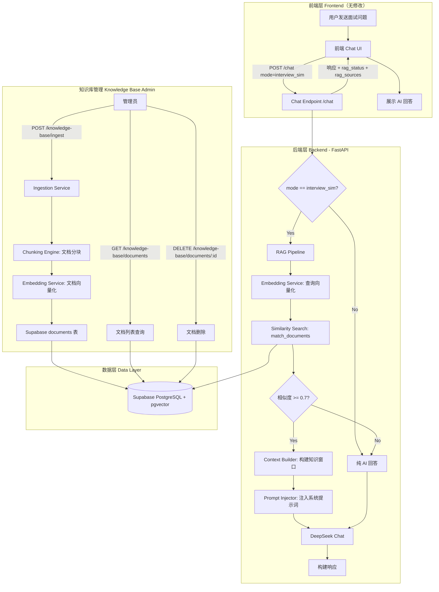
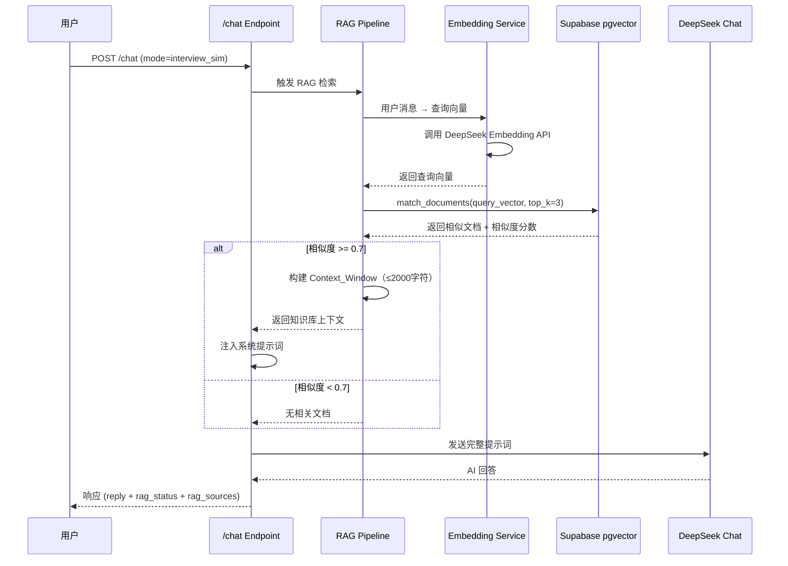
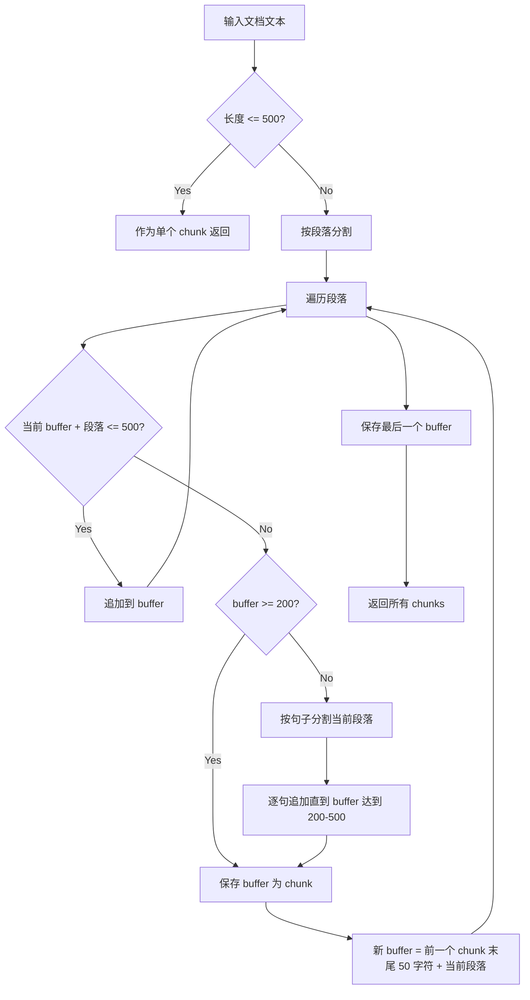

# 设计文档：面试辅导 RAG 知识库

## Overview

本设计文档描述面试辅导 RAG（检索增强生成）知识库的技术实现方案。该功能在现有的面试模拟聊天（`interview_sim` 模式）基础上，引入知识库检索能力，使 AI 面试辅导回答更加专业、准确、有据可依。

### 核心目标

1. **知识增强**：通过 RAG 管道将面试相关知识（面经、问答对、话术模板等）注入 AI 上下文
2. **精准检索**：基于 pgvector 向量相似度搜索，返回与用户问题最相关的知识片段
3. **无缝集成**：对用户透明，不改变现有聊天交互方式，仅提升回答质量
4. **优雅降级**：当知识库不可用时自动降级为纯 AI 回答，保证服务可用性

### 技术栈

- **后端**：Python 3.x + FastAPI（现有）
- **数据库**：Supabase PostgreSQL + pgvector 扩展（现有 `documents` 表 + `match_documents` 函数）
- **AI 模型**：DeepSeek Chat（`deepseek-chat`，聊天生成）
- **Embedding**：DeepSeek Embedding API（`text-embedding-v2`，文本向量化）
- **前端**：无需修改（RAG 对前端透明）

### 设计原则

1. **模块化**：RAG 管道作为独立模块，与现有聊天逻辑解耦
2. **向后兼容**：不修改现有 `/chat` 和 `/upload` 端点的请求格式
3. **配置驱动**：关键参数（Top_K、相似度阈值、分块大小）通过环境变量管理
4. **故障隔离**：RAG 管道故障不影响核心聊天功能

---

## Architecture

### 系统架构图



### RAG 管道执行流程



---

## Components and Interfaces

### 模块划分

```
backend/
├── main.py                    # 现有主文件（修改：集成 RAG 到 /chat）
├── rag/                       # 新增 RAG 模块目录
│   ├── __init__.py
│   ├── config.py              # RAG 配置管理
│   ├── embedding.py           # Embedding Service
│   ├── chunking.py            # 文档分块引擎
│   ├── pipeline.py            # RAG Pipeline 主流程
│   ├── context_builder.py     # 上下文构建器
│   └── knowledge_base.py      # 知识库管理（CRUD）
```

### 组件接口定义

#### 1. Embedding Service (`rag/embedding.py`)

```python
class EmbeddingService:
    """向量嵌入服务，封装 DeepSeek Embedding API 调用"""
    
    def __init__(self, api_key: str, base_url: str):
        """初始化 Embedding 客户端"""
        ...
    
    async def embed_text(self, text: str) -> list[float]:
        """
        将单段文本转换为向量
        
        Args:
            text: 待向量化的文本
        Returns:
            向量列表（维度与 pgvector 列一致，1536维）
        Raises:
            EmbeddingError: API 调用失败时抛出
        """
        ...
    
    async def embed_batch(self, texts: list[str]) -> list[list[float]]:
        """
        批量文本向量化
        
        Args:
            texts: 文本列表
        Returns:
            向量列表的列表
        Raises:
            EmbeddingError: API 调用失败时抛出
        """
        ...
```

#### 2. Chunking Engine (`rag/chunking.py`)

```python
class ChunkingEngine:
    """文档分块引擎"""
    
    def __init__(self, chunk_size: int = 500, overlap: int = 50, min_chunk_size: int = 200):
        """
        Args:
            chunk_size: 目标分块大小（字符数）
            overlap: 相邻分块重叠字符数
            min_chunk_size: 最小分块大小
        """
        ...
    
    def chunk_document(self, text: str) -> list[str]:
        """
        将文档文本拆分为多个语义连贯的片段
        
        Args:
            text: 原始文档文本
        Returns:
            分块后的文本列表
        """
        ...
```

#### 3. RAG Pipeline (`rag/pipeline.py`)

```python
class RAGPipeline:
    """RAG 检索增强生成管道"""
    
    def __init__(self, embedding_service: EmbeddingService, supabase_client, config: RAGConfig):
        ...
    
    async def retrieve(self, query: str) -> RAGResult:
        """
        执行完整的 RAG 检索流程
        
        Args:
            query: 用户查询文本
        Returns:
            RAGResult 包含 context_text, sources, status
        """
        ...
```

#### 4. Context Builder (`rag/context_builder.py`)

```python
class ContextBuilder:
    """将检索结果构建为可注入提示词的上下文文本"""
    
    def build_context(self, chunks: list[DocumentChunk], max_length: int = 2000) -> str:
        """
        构建知识库上下文窗口
        
        Args:
            chunks: 检索到的文档片段列表（按相似度降序）
            max_length: 上下文最大字符数
        Returns:
            格式化的上下文文本，使用【知识库参考】标记包裹
        """
        ...
```

#### 5. Knowledge Base Manager (`rag/knowledge_base.py`)

```python
class KnowledgeBaseManager:
    """知识库管理：摄入、查询、删除"""
    
    async def ingest_document(self, content: str, metadata: DocumentMetadata) -> IngestResult:
        """摄入单篇文档：分块 → 向量化 → 存储"""
        ...
    
    async def ingest_batch(self, documents: list[DocumentInput]) -> BatchIngestResult:
        """批量摄入文档"""
        ...
    
    async def list_documents(self, filters: DocumentFilters, page: int, page_size: int) -> PaginatedDocuments:
        """分页查询文档列表"""
        ...
    
    async def delete_document(self, document_id: str) -> bool:
        """删除文档及其所有分块"""
        ...
```

---

## Data Models

### 数据库表结构

使用现有的 Supabase `documents` 表，schema 如下：

```sql
-- 现有表结构（pgvector 扩展已启用）
CREATE TABLE documents (
    id UUID PRIMARY KEY DEFAULT gen_random_uuid(),
    content TEXT NOT NULL,                    -- 文档/分块文本内容
    metadata JSONB DEFAULT '{}',             -- 元数据标签
    embedding VECTOR(1536),                  -- DeepSeek embedding 向量
    created_at TIMESTAMPTZ DEFAULT NOW()     -- 创建时间
);

-- 现有函数
CREATE OR REPLACE FUNCTION match_documents(
    query_embedding VECTOR(1536),
    match_threshold FLOAT DEFAULT 0.7,
    match_count INT DEFAULT 3
)
RETURNS TABLE (
    id UUID,
    content TEXT,
    metadata JSONB,
    similarity FLOAT
)
LANGUAGE plpgsql AS $$
BEGIN
    RETURN QUERY
    SELECT
        documents.id,
        documents.content,
        documents.metadata,
        1 - (documents.embedding <=> query_embedding) AS similarity
    FROM documents
    WHERE 1 - (documents.embedding <=> query_embedding) > match_threshold
    ORDER BY documents.embedding <=> query_embedding
    LIMIT match_count;
END;
$$;
```

### Metadata JSONB 结构

```json
{
    "category": "qa_pair | interview_experience | professional_knowledge | speech_template",
    "industry": "互联网",
    "role": "后端工程师",
    "difficulty": "beginner | intermediate | advanced",
    "source_doc_id": "uuid-of-parent-document",
    "chunk_index": 0,
    "total_chunks": 3
}
```

### Pydantic 数据模型

```python
from enum import Enum
from pydantic import BaseModel, Field
from typing import Optional
from uuid import UUID
from datetime import datetime


class DocumentCategory(str, Enum):
    QA_PAIR = "qa_pair"
    INTERVIEW_EXPERIENCE = "interview_experience"
    PROFESSIONAL_KNOWLEDGE = "professional_knowledge"
    SPEECH_TEMPLATE = "speech_template"


class DifficultyLevel(str, Enum):
    BEGINNER = "beginner"
    INTERMEDIATE = "intermediate"
    ADVANCED = "advanced"


class DocumentMetadata(BaseModel):
    """文档元数据标签"""
    category: DocumentCategory
    industry: str = ""
    role: str = ""
    difficulty: DifficultyLevel = DifficultyLevel.INTERMEDIATE


class DocumentInput(BaseModel):
    """摄入请求中的单篇文档"""
    content: str = Field(..., min_length=1, description="文档文本内容")
    metadata: DocumentMetadata


class IngestRequest(BaseModel):
    """批量摄入请求体"""
    documents: list[DocumentInput] = Field(..., min_length=1, max_length=50)


class IngestResultItem(BaseModel):
    """单篇文档摄入结果"""
    index: int
    success: bool
    document_id: Optional[str] = None
    chunks_created: int = 0
    error: Optional[str] = None


class BatchIngestResponse(BaseModel):
    """批量摄入响应"""
    total: int
    success_count: int
    failure_count: int
    results: list[IngestResultItem]


class DocumentListItem(BaseModel):
    """文档列表项"""
    id: str
    content_preview: str  # 前100字符
    metadata: DocumentMetadata
    created_at: datetime


class DocumentListResponse(BaseModel):
    """分页文档列表响应"""
    documents: list[DocumentListItem]
    total: int
    page: int
    page_size: int


class RAGStatus(str, Enum):
    SUCCESS = "success"
    NO_MATCH = "no_match"
    FALLBACK = "fallback"


class RAGResult(BaseModel):
    """RAG 管道执行结果"""
    status: RAGStatus
    context_text: str = ""
    sources: list[str] = []  # 文档 ID 列表
```

---

## Correctness Properties

*A property is a characteristic or behavior that should hold true across all valid executions of a system—essentially, a formal statement about what the system should do. Properties serve as the bridge between human-readable specifications and machine-verifiable correctness guarantees.*

### Property 1: Whitespace-only text rejection

*For any* string composed entirely of whitespace characters (spaces, tabs, newlines, or empty string), the Ingestion Service SHALL reject the document and return a validation error, leaving the knowledge base unchanged.

**Validates: Requirements 1.5**

### Property 2: Chunking produces correct count based on length

*For any* document text, if the text length exceeds 500 characters then chunking SHALL produce more than one chunk, and if the text length is 500 characters or fewer then chunking SHALL produce exactly one chunk.

**Validates: Requirements 2.1, 2.6**

### Property 3: Chunk size invariant

*For any* document text, all resulting chunks SHALL have a length between 200 and 500 characters (inclusive).

**Validates: Requirements 2.2**

### Property 4: Adjacent chunk overlap

*For any* document that produces multiple chunks, the last 50 characters of chunk N SHALL equal the first 50 characters of chunk N+1, for all adjacent pairs.

**Validates: Requirements 2.3**

### Property 5: Chunk metadata inheritance

*For any* document with metadata tags, all resulting chunks SHALL carry identical metadata (category, industry, role, difficulty) plus chunk indexing fields (source_doc_id, chunk_index, total_chunks).

**Validates: Requirements 2.5**

### Property 6: Metadata enum validation

*For any* metadata input, the category field SHALL only accept values in {qa_pair, interview_experience, professional_knowledge, speech_template}, the difficulty field SHALL only accept values in {beginner, intermediate, advanced}, and the industry and role fields SHALL accept any non-null string value. Any other category or difficulty value SHALL be rejected with a validation error.

**Validates: Requirements 3.2, 3.3, 3.4, 3.5**

### Property 7: Batch response integrity

*For any* batch ingest request containing N documents (1 ≤ N ≤ 50), the response SHALL contain exactly N result items, and success_count + failure_count SHALL equal N.

**Validates: Requirements 4.3, 4.6**

### Property 8: Similarity threshold filtering

*For any* set of search results where all similarity scores are below 0.7, the RAG Pipeline SHALL return a status of "no_match" and an empty context, injecting no knowledge base content into the prompt.

**Validates: Requirements 5.5**

### Property 9: Context window size limit and completeness

*For any* set of retrieved document chunks, the constructed Context Window text SHALL not exceed 2000 characters, SHALL be wrapped in 【知识库参考】...【/知识库参考】 markers, and SHALL include chunks in descending order of similarity until the length limit is reached.

**Validates: Requirements 6.1, 6.3, 6.4**

### Property 10: No-match skips knowledge injection

*For any* chat request where the RAG Pipeline returns no matching documents (status = no_match), the final system prompt sent to the LLM SHALL NOT contain the 【知识库参考】 marker.

**Validates: Requirements 6.6**

### Property 11: RAG graceful degradation

*For any* error occurring during RAG Pipeline execution (embedding API failure, database connection failure, timeout), the Chat Endpoint SHALL still return a valid response with a non-empty reply field and rag_status set to "fallback".

**Validates: Requirements 7.3, 10.2, 10.3, 10.4**

### Property 12: rag_sources consistency with rag_status

*For any* chat response in interview_sim mode, if rag_status is "success" then rag_sources SHALL contain at least one document ID, and if rag_status is "no_match" or "fallback" then rag_sources SHALL be an empty array.

**Validates: Requirements 7.5, 7.6, 10.5**

### Property 13: Document filter correctness

*For any* filter query on the documents list endpoint, all returned documents SHALL match the specified filter criteria (category, industry, role). No document that does not match the filter SHALL appear in the results.

**Validates: Requirements 9.2**

### Property 14: Content preview truncation

*For any* document in the list response, the content_preview field SHALL equal the first 100 characters of the document's full content.

**Validates: Requirements 9.3**

### Property 15: Cascading delete removes all chunks

*For any* document that was split into N chunks during ingestion, deleting that document SHALL remove all N chunk records from the database, leaving zero records with the document's source_doc_id.

**Validates: Requirements 9.5**


---

## Error Handling

### 错误分类与处理策略

| 错误类型 | 触发场景 | 处理策略 | 用户影响 |
|---------|---------|---------|---------|
| 验证错误 | 空文档、无效元数据、超出批量限制 | 返回 400 + 具体错误信息 | 管理员看到明确错误提示 |
| Embedding API 失败 | DeepSeek API 超时/限流/服务不可用 | 摄入：返回 500；查询：降级为纯 AI | 摄入失败需重试；聊天无感知 |
| Supabase 连接失败 | 网络问题/服务不可用 | 摄入：返回 500；查询：降级为纯 AI | 同上 |
| RAG 超时 | 检索耗时超过 3 秒 | 终止检索，降级为纯 AI | 用户无感知 |
| 文档不存在 | 删除不存在的 document_id | 返回 404 | 管理员看到 404 |
| 认证失败 | 管理端点缺少/错误 API Key | 返回 401 | 管理员需提供正确 Key |

### 降级处理流程

```python
async def execute_rag_with_fallback(query: str) -> RAGResult:
    """带降级的 RAG 执行"""
    try:
        result = await asyncio.wait_for(
            rag_pipeline.retrieve(query),
            timeout=3.0  # 3秒超时
        )
        return result
    except asyncio.TimeoutError:
        logger.warning("RAG pipeline timeout, falling back to pure AI")
        return RAGResult(status=RAGStatus.FALLBACK, context_text="", sources=[])
    except EmbeddingError as e:
        logger.error(f"Embedding API error: {e}")
        return RAGResult(status=RAGStatus.FALLBACK, context_text="", sources=[])
    except Exception as e:
        logger.error(f"RAG pipeline unexpected error: {e}")
        return RAGResult(status=RAGStatus.FALLBACK, context_text="", sources=[])
```

### 日志记录策略

- **INFO**：正常 RAG 检索完成、文档摄入成功
- **WARNING**：RAG 超时降级、相似度低于阈值
- **ERROR**：API 调用失败、数据库连接失败、意外异常

使用 Python `logging` 模块，日志格式包含时间戳、级别、模块名和消息：

```python
import logging
logger = logging.getLogger("rag")
logging.basicConfig(
    level=logging.INFO,
    format="%(asctime)s [%(levelname)s] %(name)s: %(message)s"
)
```

---

## Testing Strategy

### 测试框架选择

- **单元测试**：pytest + pytest-asyncio
- **属性测试**：hypothesis（Python PBT 库）
- **Mock**：unittest.mock / pytest-mock（模拟 DeepSeek API 和 Supabase）

### 属性测试（Property-Based Testing）

本功能适合 PBT，因为核心逻辑（分块算法、元数据验证、上下文构建）是纯函数，输入空间大，存在明确的不变量。

**配置要求**：
- 每个属性测试最少运行 100 次迭代
- 使用 `@settings(max_examples=200)` 配置 hypothesis
- 每个测试标注对应的设计文档属性

**标注格式**：`# Feature: interview-rag-knowledge-base, Property {number}: {property_text}`

#### 属性测试覆盖范围

| 属性编号 | 测试目标 | 生成器策略 |
|---------|---------|-----------|
| Property 1 | 空白文本拒绝 | `st.text(alphabet=st.characters(whitespace_categories=("Zs", "Cc")))` |
| Property 2 | 分块数量正确性 | `st.text(min_size=1, max_size=5000)` |
| Property 3 | 分块大小范围 | `st.text(min_size=501, max_size=5000)` |
| Property 4 | 相邻分块重叠 | `st.text(min_size=600, max_size=3000)` |
| Property 5 | 元数据继承 | 随机文本 + 随机有效元数据 |
| Property 6 | 枚举验证 | `st.text()` 用于无效值，`st.sampled_from(enum)` 用于有效值 |
| Property 7 | 批量响应完整性 | `st.lists(st.builds(DocumentInput), min_size=1, max_size=50)` |
| Property 8 | 相似度阈值过滤 | `st.lists(st.floats(min_value=0, max_value=0.69))` |
| Property 9 | 上下文窗口限制 | 随机长度的 chunk 列表 |
| Property 10 | 无匹配跳过注入 | 空结果集 |
| Property 11 | 降级处理 | 随机异常类型 |
| Property 12 | sources 一致性 | 随机 RAGStatus + sources 组合 |
| Property 13 | 过滤正确性 | 随机文档集 + 随机过滤条件 |
| Property 14 | 预览截断 | `st.text(min_size=1, max_size=1000)` |
| Property 15 | 级联删除 | 随机分块数量 |

### 单元测试覆盖范围

- API 端点请求/响应格式验证
- 认证中间件（有效/无效 API Key）
- 特定内容类型的摄入（qa_pair、面经等）
- 边界条件：恰好 500 字符的文档、恰好 50 篇的批量请求
- RAG 超时场景模拟

### 集成测试

- 完整摄入流程（文档 → 分块 → 向量化 → 存储）使用 mock Supabase
- 完整检索流程（查询 → 向量化 → 搜索 → 上下文构建 → 注入）
- `/chat` 端点在 interview_sim 模式下的 RAG 集成

### 测试目录结构

```
backend/
├── tests/
│   ├── __init__.py
│   ├── conftest.py              # 共享 fixtures（mock clients）
│   ├── test_chunking.py         # 分块算法属性测试
│   ├── test_embedding.py        # Embedding 服务单元测试
│   ├── test_context_builder.py  # 上下文构建属性测试
│   ├── test_knowledge_base.py   # 知识库管理测试
│   ├── test_pipeline.py         # RAG 管道集成测试
│   ├── test_metadata.py         # 元数据验证属性测试
│   └── test_api_endpoints.py    # API 端点测试
```

---

## Configuration Management

### 环境变量

在现有 `.env` 文件中新增以下配置：

```env
# RAG 知识库配置
DEEPSEEK_API_KEY=your-deepseek-api-key
DEEPSEEK_EMBEDDING_MODEL=text-embedding-v2
DEEPSEEK_EMBEDDING_BASE_URL=https://api.deepseek.com/v1

# Supabase 配置
SUPABASE_URL=https://crizpngpudekwrddhoik.supabase.co
SUPABASE_SERVICE_KEY=your-supabase-service-key

# RAG 管道参数
RAG_TOP_K=3
RAG_SIMILARITY_THRESHOLD=0.7
RAG_TIMEOUT_SECONDS=3
RAG_CONTEXT_MAX_LENGTH=2000

# 分块参数
CHUNK_SIZE=500
CHUNK_OVERLAP=50
CHUNK_MIN_SIZE=200

# 管理端点认证
KNOWLEDGE_BASE_ADMIN_KEY=your-admin-api-key
```

### 配置模块 (`rag/config.py`)

```python
from pydantic_settings import BaseSettings


class RAGConfig(BaseSettings):
    """RAG 知识库配置"""
    
    # DeepSeek Embedding
    deepseek_api_key: str
    deepseek_embedding_model: str = "text-embedding-v2"
    deepseek_embedding_base_url: str = "https://api.deepseek.com/v1"
    
    # Supabase
    supabase_url: str
    supabase_service_key: str
    
    # RAG Pipeline
    rag_top_k: int = 3
    rag_similarity_threshold: float = 0.7
    rag_timeout_seconds: float = 3.0
    rag_context_max_length: int = 2000
    
    # Chunking
    chunk_size: int = 500
    chunk_overlap: int = 50
    chunk_min_size: int = 200
    
    # Admin Auth
    knowledge_base_admin_key: str = ""
    
    class Config:
        env_file = ".env"
        env_file_encoding = "utf-8"
```

### API 端点认证

管理端点使用简单的 API Key 认证（通过 Header）：

```python
from fastapi import Header, HTTPException

async def verify_admin_key(x_admin_key: str = Header(...)):
    """验证管理员 API Key"""
    config = RAGConfig()
    if x_admin_key != config.knowledge_base_admin_key:
        raise HTTPException(status_code=401, detail="Invalid admin key")
```

### 新增依赖

```
# requirements.txt 新增
supabase>=2.0.0
httpx>=0.25.0
pydantic-settings>=2.0.0
hypothesis>=6.0.0  # 开发依赖，用于属性测试
```

---

## Chunking Algorithm Design

### 算法概述

分块算法采用"段落优先 + 句子边界回退 + 硬截断兜底"的三级策略：



### 核心实现逻辑

```python
import re

class ChunkingEngine:
    def __init__(self, chunk_size: int = 500, overlap: int = 50, min_chunk_size: int = 200):
        self.chunk_size = chunk_size
        self.overlap = overlap
        self.min_chunk_size = min_chunk_size
    
    def chunk_document(self, text: str) -> list[str]:
        """将文档拆分为语义连贯的片段"""
        text = text.strip()
        if not text:
            return []
        if len(text) <= self.chunk_size:
            return [text]
        
        chunks = []
        # 按段落分割（双换行或单换行）
        paragraphs = re.split(r'\n\s*\n|\n', text)
        paragraphs = [p.strip() for p in paragraphs if p.strip()]
        
        buffer = ""
        for para in paragraphs:
            if len(buffer) + len(para) + 1 <= self.chunk_size:
                buffer = buffer + "\n" + para if buffer else para
            else:
                if len(buffer) >= self.min_chunk_size:
                    chunks.append(buffer)
                    # 重叠：取前一个 chunk 末尾 overlap 字符作为新 buffer 开头
                    overlap_text = buffer[-self.overlap:] if len(buffer) >= self.overlap else buffer
                    buffer = overlap_text + "\n" + para
                else:
                    # buffer 太短，尝试按句子拆分当前段落并追加
                    sentences = self._split_sentences(para)
                    for sent in sentences:
                        if len(buffer) + len(sent) + 1 <= self.chunk_size:
                            buffer = buffer + sent if buffer else sent
                        else:
                            if len(buffer) >= self.min_chunk_size:
                                chunks.append(buffer)
                                overlap_text = buffer[-self.overlap:]
                                buffer = overlap_text + sent
                            else:
                                # 硬截断兜底
                                buffer = buffer + sent
                                if len(buffer) >= self.chunk_size:
                                    chunks.append(buffer[:self.chunk_size])
                                    overlap_text = buffer[self.chunk_size - self.overlap:self.chunk_size]
                                    buffer = overlap_text + buffer[self.chunk_size:]
        
        # 处理最后一个 buffer
        if buffer:
            if chunks and len(buffer) < self.min_chunk_size:
                # 最后一块太短，合并到前一块（如果合并后不超限）
                if len(chunks[-1]) + len(buffer) <= self.chunk_size:
                    chunks[-1] = chunks[-1] + "\n" + buffer
                else:
                    chunks.append(buffer)
            else:
                chunks.append(buffer)
        
        return chunks
    
    def _split_sentences(self, text: str) -> list[str]:
        """按中文/英文句子边界分割"""
        # 中文句号、问号、感叹号、分号；英文句号、问号、感叹号
        sentences = re.split(r'(?<=[。？！；.?!])', text)
        return [s for s in sentences if s.strip()]
```

### 设计决策说明

1. **段落优先**：面试知识文档通常按段落组织（一个问题一段、一个知识点一段），段落边界是最自然的分割点
2. **50 字符重叠**：确保跨分块的语义连贯性，避免关键信息被截断在两个 chunk 之间
3. **200-500 字符范围**：200 字符保证每个 chunk 有足够语义信息；500 字符避免单个 chunk 过长导致检索精度下降
4. **硬截断兜底**：处理极端情况（如一个超长段落无句子边界），保证算法不会死循环
