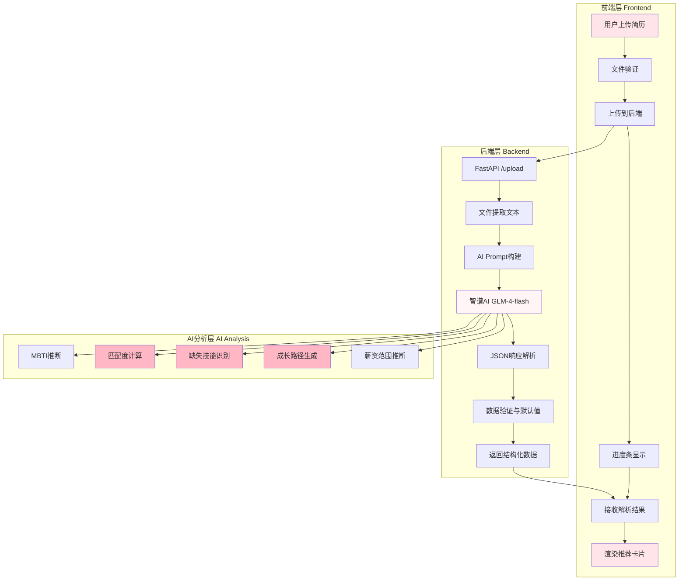

# 设计文档：岗位推荐增强功能

## Overview

本设计文档描述了岗位推荐增强功能的技术实现方案。该功能在现有的简历解析和岗位推荐系统基础上，新增匹配度百分比、缺失技能分析和成长路径说明三个核心维度，并优化前端展示布局，提供更全面、更有价值的岗位推荐信息。

### 核心目标

1. **量化匹配度**：通过0-100的整数分数直观展示候选人与岗位的匹配程度
2. **识别技能缺口**：帮助求职者了解需要学习的技能，提供明确的提升方向
3. **展示成长路径**：描绘职业发展轨迹，帮助求职者规划长期职业路径
4. **优化用户体验**：通过樱花粉配色系统和响应式设计，提供清晰美观的信息展示

### 技术栈

- **后端**：Python 3.x + FastAPI
- **AI模型**：智谱AI GLM-4-flash
- **前端**：原生JavaScript + HTML5 + CSS3
- **文档解析**：PyMuPDF (PDF) + python-docx (DOCX)

### 设计原则

1. **向后兼容**：保留现有功能（推荐原因、薪资范围），确保平滑升级
2. **降级优雅**：当AI无法生成某些字段时，使用合理默认值，不影响整体功能
3. **性能优先**：AI分析时间控制在10秒内，前端渲染在100毫秒内完成
4. **用户体验**：信息分组清晰，视觉层次分明，响应式适配移动端

---

## Architecture

### 系统架构图



### 数据流

1. **上传阶段**：用户选择简历文件 → 前端验证格式和大小 → 通过FormData上传到后端
2. **解析阶段**：后端提取文本 → 构建AI Prompt → 调用智谱AI → 解析JSON响应
3. **增强阶段**：AI计算匹配度 → 识别缺失技能 → 生成成长路径 → 推断薪资范围
4. **展示阶段**：后端返回结构化数据 → 前端渲染卡片 → 用户查看推荐信息

### 关键组件

#### 1. AI Prompt优化模块
- **职责**：构建包含新增字段要求的AI Prompt
- **输入**：简历原始文本
- **输出**：包含match_score、missing_skills、career_path的JSON结构
- **关键逻辑**：
  - 明确字段格式和示例
  - 强调基于简历内容分析，避免模板化
  - 提供薪资推断规则（城市、行业、经验）

#### 2. 匹配度计算引擎
- **职责**：基于多维度因素计算0-100的匹配度分数
- **权重分配**：
  - 技能匹配度：40%
  - 工作经验匹配度：25%
  - 教育背景匹配度：20%
  - MBTI人格匹配度：15%
- **输出**：整数分数 + 匹配等级标签（高/中/低）

#### 3. 技能缺口分析器
- **职责**：对比岗位要求与候选人技能，识别缺失项
- **输入**：候选人简历技能列表 + 岗位要求技能列表
- **输出**：0-5个缺失技能，按重要性排序
- **特殊情况**：完全匹配时返回空数组

#### 4. 成长路径生成器
- **职责**：基于岗位特点生成2-4个职业发展阶段
- **输入**：岗位名称、行业、候选人背景
- **输出**：60-100字的成长路径描述
- **格式**：初级岗位 → 中级岗位 → 高级岗位 → 专家岗位

#### 5. 前端卡片渲染器
- **职责**：将后端数据渲染为樱花粉风格的推荐卡片
- **布局**：垂直布局，信息模块清晰分隔
- **交互**：悬停高亮、点击跳转招聘网站
- **响应式**：3列（桌面）→ 2列（平板）→ 1列（手机）

---

## Components and Interfaces

### 后端组件

#### 1. `/upload` API端点扩展

**现有功能**：
- 接收PDF/DOCX文件
- 提取文本内容
- 调用AI解析简历
- 返回MBTI、候选人简介、岗位推荐

**新增功能**：
- 扩展AI Prompt，要求生成match_score、missing_skills、career_path
- 扩展响应数据结构，包含新增字段
- 添加字段验证和默认值处理

**接口定义**：

```python
@app.post("/upload")
async def upload_resume(file: UploadFile = File(...)) -> dict[str, Any]:
    """
    上传并解析简历，返回增强后的岗位推荐数据
    
    Returns:
        {
            "filename": str,
            "parse_status": "success",
            "parsed_data": {
                "inferred_mbti": str,
                "mbti_description": str,
                "candidate_summary": str,
                "city": str,
                "job_recommendations": [
                    {
                        "title": str,
                        "industry": str,
                        "match_score": int,  # 新增
                        "reason": str,
                        "salary_range": {
                            "min_salary": int,
                            "max_salary": int,
                            "city": str
                        },
                        "missing_skills": [str],  # 新增
                        "career_path": str  # 新增
                    }
                ],
                "resume_diagnosis": {...}
            }
        }
    """
```

#### 2. AI Prompt构建函数

**函数签名**：
```python
def _parse_resume_with_ai(raw_text: str) -> dict[str, Any]:
    """
    使用智谱AI解析简历并生成增强字段
    
    Args:
        raw_text: 简历原始文本
        
    Returns:
        包含所有字段的字典，包括新增的match_score、missing_skills、career_path
    """
```

**Prompt结构**（新增部分）：

```
5) job_recommendations: 数组，推荐6个适合该候选人的岗位，每项包含：
   - title: 岗位名称
   - industry: 所属行业
   - match_score: 整数 0-100，匹配度分数
     【计算规则】：
     * 技能匹配度（40%）：候选人技能与岗位要求的重合度
     * 工作经验匹配度（25%）：工作年限、项目经验与岗位要求的匹配度
     * 教育背景匹配度（20%）：学历、专业与岗位要求的匹配度
     * MBTI人格匹配度（15%）：人格特质与岗位特点的契合度
     * 综合计算后取整，范围0-100
   
   - reason: 推荐理由（30字以内）
   
   - missing_skills: 数组，候选人缺失的关键技能（0-5个）
     【识别规则】：
     * 只包含岗位要求中重要但候选人简历未体现的技能
     * 按重要性排序（核心技能优先）
     * 如果候选人技能完全满足岗位要求，返回空数组 []
     * 示例：["Python", "Docker", "Kubernetes"]
   
   - career_path: 字符串，该岗位的职业成长路径（60-100字）
     【生成规则】：
     * 包含2-4个职业发展阶段
     * 使用具体岗位名称（如："初级产品经理 → 产品经理 → 高级产品经理 → 产品总监"）
     * 基于行业标准和岗位特点，确保真实可行
     * 简洁明了，突出晋升路线
   
   - salary_range: 对象（保持现有逻辑）
```

#### 3. 数据验证与默认值处理

**函数签名**：
```python
def _validate_and_set_defaults(parsed_data: dict[str, Any]) -> dict[str, Any]:
    """
    验证AI返回的数据，为缺失字段设置默认值
    
    Args:
        parsed_data: AI返回的原始数据
        
    Returns:
        验证并补全后的数据
        
    Default Values:
        - match_score: 70 (如果缺失或无效)
        - missing_skills: [] (如果缺失)
        - career_path: "" (如果缺失)
    """
```

### 前端组件

#### 1. 推荐卡片组件 (Recommendation Card)

**HTML结构**：

```html
<div class="job-card">
  <!-- 标题行：岗位名称 + 匹配度徽章 -->
  <div class="job-header">
    <div class="job-title">算法工程师</div>
    <div class="match-badge-wrapper">
      <span class="match-percentage">85%</span>
      <span class="match-badge match-high">高匹配</span>
    </div>
  </div>
  
  <!-- 标签行：行业 -->
  <div class="industry-tag">科技</div>
  
  <!-- 薪资行 -->
  <div class="job-salary">
    <span class="salary-amount">25-40K</span>
    <span class="salary-city">北京</span>
  </div>
  
  <!-- 推荐原因 -->
  <div class="job-section">
    <div class="section-icon">💡</div>
    <div class="section-content">
      <div class="section-title">推荐原因</div>
      <div class="job-reason">结合你的机器学习背景和Python技能...</div>
    </div>
  </div>
  
  <!-- 缺失技能 -->
  <div class="job-section">
    <div class="section-icon">📚</div>
    <div class="section-content">
      <div class="section-title">需要学习</div>
      <div class="skill-tags">
        <span class="skill-tag">Docker</span>
        <span class="skill-tag">Kubernetes</span>
      </div>
    </div>
  </div>
  
  <!-- 成长路径 -->
  <div class="job-section">
    <div class="section-icon">🚀</div>
    <div class="section-content">
      <div class="section-title">成长路径</div>
      <div class="career-path">
        <span class="path-stage">初级算法工程师</span>
        <span class="path-arrow">→</span>
        <span class="path-stage">算法工程师</span>
        <span class="path-arrow">→</span>
        <span class="path-stage">高级算法工程师</span>
        <span class="path-arrow">→</span>
        <span class="path-stage">算法专家</span>
      </div>
    </div>
  </div>
</div>
```

**CSS样式要点**：

```css
/* 匹配度徽章 - 醒目圆形设计 */
.match-badge-wrapper {
  display: flex;
  flex-direction: column;
  align-items: center;
  gap: 4px;
}

.match-percentage {
  font-size: 24px;
  font-weight: 800;
  color: var(--sakura-primary);
  font-family: 'Inter', sans-serif;
  line-height: 1;
}

.match-badge {
  font-size: 10px;
  font-weight: 700;
  padding: 3px 8px;
  border-radius: 999px;
}

.match-high {
  background: #dcfce7;
  color: #15803d;
}

.match-mid {
  background: #fef9c3;
  color: #a16207;
}

.match-low {
  background: var(--gray-200);
  color: var(--gray-600);
}

/* 信息分组 - 浅色背景 */
.job-section {
  display: flex;
  gap: 10px;
  padding: 12px;
  background: var(--sakura-lighter);
  border-radius: var(--radius-sm);
  margin-top: 10px;
}

.section-icon {
  font-size: 18px;
  flex-shrink: 0;
}

.section-title {
  font-size: 11px;
  font-weight: 700;
  color: var(--gray-600);
  margin-bottom: 4px;
  text-transform: uppercase;
  letter-spacing: 0.5px;
}

/* 技能标签 */
.skill-tags {
  display: flex;
  flex-wrap: wrap;
  gap: 6px;
}

.skill-tag {
  font-size: 11px;
  font-weight: 600;
  padding: 4px 10px;
  background: var(--white);
  border: 1.5px solid var(--sakura-primary);
  color: var(--sakura-dark);
  border-radius: 999px;
}

/* 成长路径 - 箭头展示 */
.career-path {
  display: flex;
  flex-wrap: wrap;
  align-items: center;
  gap: 6px;
  font-size: 11px;
  line-height: 1.6;
}

.path-stage {
  font-weight: 600;
  color: var(--gray-700);
}

.path-arrow {
  color: var(--sakura-primary);
  font-weight: 700;
}

/* 卡片高度自适应 */
.job-card {
  max-height: 400px;
  overflow-y: auto;
}

/* 响应式设计 */
@media (max-width: 900px) {
  .jobs-grid {
    grid-template-columns: repeat(2, 1fr);
  }
}

@media (max-width: 560px) {
  .jobs-grid {
    grid-template-columns: 1fr;
  }
  
  .match-percentage {
    font-size: 20px;
  }
  
  .career-path {
    flex-direction: column;
    align-items: flex-start;
  }
  
  .path-arrow {
    transform: rotate(90deg);
  }
}
```

#### 2. 渲染函数

**函数签名**：
```javascript
function renderJobCard(job) {
  /**
   * 渲染单个岗位推荐卡片
   * 
   * @param {Object} job - 岗位数据对象
   * @param {string} job.title - 岗位名称
   * @param {string} job.industry - 行业
   * @param {number} job.match_score - 匹配度分数 (0-100)
   * @param {string} job.reason - 推荐原因
   * @param {Object} job.salary_range - 薪资范围
   * @param {Array<string>} job.missing_skills - 缺失技能列表
   * @param {string} job.career_path - 成长路径
   * 
   * @returns {HTMLElement} 卡片DOM元素
   */
}
```

**关键逻辑**：

1. **匹配度等级判断**：
```javascript
function getMatchLevel(score) {
  if (score >= 80) return { level: '高匹配', class: 'match-high' };
  if (score >= 60) return { level: '中匹配', class: 'match-mid' };
  return { level: '低匹配', class: 'match-low' };
}
```

2. **缺失技能处理**：
```javascript
function renderMissingSkills(skills) {
  if (!skills || skills.length === 0) {
    return '<div class="skill-complete">技能完全匹配 ✓</div>';
  }
  return skills.map(skill => 
    `<span class="skill-tag">${skill}</span>`
  ).join('');
}
```

3. **成长路径解析**：
```javascript
function renderCareerPath(pathText) {
  if (!pathText) return '';
  
  // 将文本按箭头分割为阶段
  const stages = pathText.split(/[→>]/);
  return stages.map((stage, index) => `
    <span class="path-stage">${stage.trim()}</span>
    ${index < stages.length - 1 ? '<span class="path-arrow">→</span>' : ''}
  `).join('');
}
```

---

## Data Models

### 后端数据模型

#### 1. JobRecommendation（岗位推荐对象）

```python
from typing import List, Optional
from pydantic import BaseModel, Field

class SalaryRange(BaseModel):
    """薪资范围"""
    min_salary: int = Field(..., ge=0, description="最低月薪（单位：千元）")
    max_salary: int = Field(..., ge=0, description="最高月薪（单位：千元）")
    city: str = Field(default="全国", description="薪资对应城市")

class JobRecommendation(BaseModel):
    """岗位推荐"""
    title: str = Field(..., min_length=1, description="岗位名称")
    industry: str = Field(..., min_length=1, description="所属行业")
    match_score: int = Field(..., ge=0, le=100, description="匹配度分数")
    reason: str = Field(..., max_length=50, description="推荐原因")
    salary_range: SalaryRange = Field(..., description="薪资范围")
    missing_skills: List[str] = Field(default_factory=list, max_items=5, description="缺失技能")
    career_path: str = Field(default="", max_length=100, description="成长路径")
```

#### 2. ParsedResumeData（解析后的简历数据）

```python
class ResumeDiagnosis(BaseModel):
    """简历诊断"""
    typos: List[dict] = Field(default_factory=list)
    grammar_issues: List[dict] = Field(default_factory=list)
    redundancy: List[dict] = Field(default_factory=list)
    overall_score: int = Field(default=70, ge=0, le=100)
    overall_comment: str = Field(default="")

class ParsedResumeData(BaseModel):
    """解析后的简历数据"""
    inferred_mbti: str = Field(..., pattern="^[IE][NS][TF][JP]$")
    mbti_description: str = Field(..., max_length=60)
    candidate_summary: str = Field(..., max_length=80)
    city: str = Field(default="")
    job_recommendations: List[JobRecommendation] = Field(..., min_items=1, max_items=6)
    resume_diagnosis: ResumeDiagnosis = Field(...)
```

### 前端数据模型

#### 1. JavaScript对象结构

```javascript
/**
 * 岗位推荐数据结构
 * @typedef {Object} JobRecommendation
 * @property {string} title - 岗位名称
 * @property {string} industry - 所属行业
 * @property {number} match_score - 匹配度分数 (0-100)
 * @property {string} reason - 推荐原因
 * @property {SalaryRange} salary_range - 薪资范围
 * @property {string[]} missing_skills - 缺失技能列表 (0-5个)
 * @property {string} career_path - 成长路径描述
 */

/**
 * 薪资范围
 * @typedef {Object} SalaryRange
 * @property {number} min_salary - 最低月薪（千元）
 * @property {number} max_salary - 最高月薪（千元）
 * @property {string} city - 城市名称
 */

/**
 * API响应数据结构
 * @typedef {Object} UploadResponse
 * @property {string} filename - 文件名
 * @property {string} parse_status - 解析状态
 * @property {ParsedData} parsed_data - 解析后的数据
 * @property {string} message - 响应消息
 */

/**
 * 解析后的数据
 * @typedef {Object} ParsedData
 * @property {string} inferred_mbti - MBTI类型
 * @property {string} mbti_description - MBTI描述
 * @property {string} candidate_summary - 候选人简介
 * @property {string} city - 城市
 * @property {JobRecommendation[]} job_recommendations - 岗位推荐列表
 * @property {Object} resume_diagnosis - 简历诊断
 */
```

### 数据验证规则

#### 后端验证

1. **match_score**：
   - 类型：整数
   - 范围：0-100
   - 默认值：70（当AI返回无效值时）

2. **missing_skills**：
   - 类型：字符串数组
   - 长度：0-5
   - 默认值：[]（当AI返回无效值时）
   - 元素验证：非空字符串，长度1-30

3. **career_path**：
   - 类型：字符串
   - 长度：0-100字符
   - 默认值：""（当AI返回无效值时）

#### 前端验证

```javascript
function validateJobData(job) {
  // 验证必需字段
  if (!job.title || !job.industry) {
    console.warn('Missing required fields:', job);
    return false;
  }
  
  // 验证match_score
  if (typeof job.match_score !== 'number' || 
      job.match_score < 0 || 
      job.match_score > 100) {
    job.match_score = 70; // 使用默认值
  }
  
  // 验证missing_skills
  if (!Array.isArray(job.missing_skills)) {
    job.missing_skills = [];
  } else {
    job.missing_skills = job.missing_skills
      .filter(skill => typeof skill === 'string' && skill.trim())
      .slice(0, 5);
  }
  
  // 验证career_path
  if (typeof job.career_path !== 'string') {
    job.career_path = '';
  } else {
    job.career_path = job.career_path.slice(0, 100);
  }
  
  return true;
}
```

---


## Error Handling

### 错误分类与处理策略

#### 1. AI生成错误

**场景1：AI返回非JSON格式**
- **检测**：JSON解析失败
- **处理**：尝试提取代码块中的JSON，如果仍失败则抛出异常
- **日志**：记录原始响应内容，便于调试
- **用户提示**："AI解析失败，请稍后重试"

**场景2：AI返回的JSON缺少必需字段**
- **检测**：字段验证失败
- **处理**：使用默认值填充
  - `match_score`: 70
  - `missing_skills`: []
  - `career_path`: ""
- **日志**：记录缺失字段名称
- **用户提示**：正常显示，不提示错误

**场景3：AI返回的字段值无效**
- **检测**：类型或范围验证失败
- **处理**：
  - `match_score` 不在0-100范围：使用70
  - `missing_skills` 不是数组：使用[]
  - `career_path` 不是字符串：使用""
- **日志**：记录无效值和修正后的值
- **用户提示**：正常显示，不提示错误

#### 2. 文件处理错误

**场景1：文件格式不支持**
- **检测**：MIME类型或扩展名不匹配
- **处理**：拒绝上传，返回400错误
- **用户提示**："仅支持 PDF 和 DOCX 格式"

**场景2：文件过大**
- **检测**：文件大小超过5MB
- **处理**：拒绝上传，返回400错误
- **用户提示**："文件过大，最大支持 5MB"

**场景3：文件内容为空**
- **检测**：提取文本后长度为0
- **处理**：返回400错误
- **用户提示**："文件内容为空或无法读取"

#### 3. 网络错误

**场景1：上传超时**
- **检测**：XHR timeout事件
- **处理**：停止进度条，显示错误信息
- **用户提示**："请求超时，请检查网络后重试"
- **重试机制**：允许用户手动重试

**场景2：网络断开**
- **检测**：XHR error事件
- **处理**：停止进度条，显示错误信息
- **用户提示**："网络错误，上传失败"
- **重试机制**：允许用户手动重试

**场景3：服务器错误（5xx）**
- **检测**：HTTP状态码 >= 500
- **处理**：显示错误信息
- **用户提示**："服务器错误，请稍后重试"
- **日志**：记录错误详情

#### 4. 前端渲染错误

**场景1：数据结构不完整**
- **检测**：必需字段缺失
- **处理**：使用默认值或跳过该项
- **用户提示**：不显示错误，优雅降级
- **日志**：控制台警告

**场景2：渲染异常**
- **检测**：try-catch捕获
- **处理**：跳过该卡片，继续渲染其他卡片
- **用户提示**：不显示错误
- **日志**：控制台错误

### 错误处理代码示例

#### 后端错误处理

```python
def _validate_and_set_defaults(parsed_data: dict[str, Any]) -> dict[str, Any]:
    """验证并设置默认值"""
    try:
        # 验证job_recommendations
        if "job_recommendations" not in parsed_data:
            raise ValueError("Missing job_recommendations field")
        
        jobs = parsed_data["job_recommendations"]
        for job in jobs:
            # 验证match_score
            if "match_score" not in job or not isinstance(job["match_score"], int):
                logger.warning(f"Invalid match_score for job {job.get('title')}, using default 70")
                job["match_score"] = 70
            elif job["match_score"] < 0 or job["match_score"] > 100:
                logger.warning(f"match_score out of range for job {job.get('title')}, clamping to 0-100")
                job["match_score"] = max(0, min(100, job["match_score"]))
            
            # 验证missing_skills
            if "missing_skills" not in job or not isinstance(job["missing_skills"], list):
                logger.warning(f"Invalid missing_skills for job {job.get('title')}, using empty array")
                job["missing_skills"] = []
            else:
                # 过滤无效技能，限制数量
                job["missing_skills"] = [
                    skill for skill in job["missing_skills"]
                    if isinstance(skill, str) and skill.strip()
                ][:5]
            
            # 验证career_path
            if "career_path" not in job or not isinstance(job["career_path"], str):
                logger.warning(f"Invalid career_path for job {job.get('title')}, using empty string")
                job["career_path"] = ""
            else:
                job["career_path"] = job["career_path"][:100]
        
        return parsed_data
    
    except Exception as e:
        logger.error(f"Data validation failed: {e}")
        raise HTTPException(status_code=500, detail=f"Data validation failed: {e}")
```

#### 前端错误处理

```javascript
function renderJobCard(job) {
  try {
    // 验证必需字段
    if (!job.title || !job.industry) {
      console.warn('Missing required fields in job data:', job);
      return null;
    }
    
    // 验证并修正match_score
    let matchScore = job.match_score;
    if (typeof matchScore !== 'number' || matchScore < 0 || matchScore > 100) {
      console.warn(`Invalid match_score: ${matchScore}, using default 70`);
      matchScore = 70;
    }
    
    // 验证并修正missing_skills
    let missingSkills = job.missing_skills;
    if (!Array.isArray(missingSkills)) {
      console.warn('missing_skills is not an array, using empty array');
      missingSkills = [];
    } else {
      missingSkills = missingSkills
        .filter(skill => typeof skill === 'string' && skill.trim())
        .slice(0, 5);
    }
    
    // 验证并修正career_path
    let careerPath = job.career_path;
    if (typeof careerPath !== 'string') {
      console.warn('career_path is not a string, using empty string');
      careerPath = '';
    }
    
    // 创建卡片元素
    const card = document.createElement('div');
    card.className = 'job-card';
    
    // ... 渲染逻辑
    
    return card;
    
  } catch (error) {
    console.error('Failed to render job card:', error, job);
    return null; // 返回null，跳过该卡片
  }
}

function renderAllJobs(jobs) {
  const container = document.getElementById('jobsGrid');
  container.innerHTML = '';
  
  if (!Array.isArray(jobs) || jobs.length === 0) {
    // 显示空状态
    container.innerHTML = '<div class="empty-state">暂无岗位推荐</div>';
    return;
  }
  
  jobs.forEach(job => {
    const card = renderJobCard(job);
    if (card) {
      container.appendChild(card);
    }
  });
  
  // 如果所有卡片都渲染失败
  if (container.children.length === 0) {
    container.innerHTML = '<div class="empty-state">岗位数据加载失败</div>';
  }
}
```

### 日志记录策略

#### 后端日志

```python
import logging

logger = logging.getLogger(__name__)

# 记录AI响应原始内容（仅在解析失败时）
logger.error(f"Failed to parse AI response: {response_text[:500]}")

# 记录字段验证警告
logger.warning(f"Field validation: {field_name} is invalid, using default value")

# 记录文件处理错误
logger.error(f"File processing failed: {filename}, error: {str(e)}")

# 记录API调用错误
logger.error(f"AI API call failed: {str(e)}")
```

#### 前端日志

```javascript
// 记录数据验证警告
console.warn('Data validation:', message, data);

// 记录渲染错误
console.error('Render error:', error, context);

// 记录网络错误
console.error('Network error:', error);
```

---

## Testing Strategy

### 测试方法论

本功能采用**多层次测试策略**，结合单元测试、集成测试和端到端测试，确保功能的正确性和稳定性。由于核心逻辑依赖AI生成内容，**不适合大规模使用Property-Based Testing**，但会对数据验证和转换逻辑使用PBT。

### 测试层次

#### 1. 单元测试（Unit Tests）

**测试目标**：验证独立函数和组件的正确性

**测试框架**：
- 后端：pytest
- 前端：Jest

**测试用例**：

##### 后端单元测试

**测试1：数据验证函数**
```python
def test_validate_match_score():
    """测试match_score验证逻辑"""
    # 有效值
    assert validate_match_score(85) == 85
    assert validate_match_score(0) == 0
    assert validate_match_score(100) == 100
    
    # 无效值 - 使用默认值70
    assert validate_match_score(-10) == 70
    assert validate_match_score(150) == 70
    assert validate_match_score(None) == 70
    assert validate_match_score("85") == 70

def test_validate_missing_skills():
    """测试missing_skills验证逻辑"""
    # 有效值
    assert validate_missing_skills(["Python", "Docker"]) == ["Python", "Docker"]
    assert validate_missing_skills([]) == []
    
    # 过滤无效元素
    assert validate_missing_skills(["Python", "", "Docker", None]) == ["Python", "Docker"]
    
    # 限制数量
    skills = ["A", "B", "C", "D", "E", "F"]
    assert len(validate_missing_skills(skills)) == 5
    
    # 无效值 - 使用空数组
    assert validate_missing_skills(None) == []
    assert validate_missing_skills("Python") == []

def test_validate_career_path():
    """测试career_path验证逻辑"""
    # 有效值
    assert validate_career_path("初级 → 中级 → 高级") == "初级 → 中级 → 高级"
    assert validate_career_path("") == ""
    
    # 截断过长文本
    long_text = "A" * 150
    assert len(validate_career_path(long_text)) == 100
    
    # 无效值 - 使用空字符串
    assert validate_career_path(None) == ""
    assert validate_career_path(123) == ""
```

**测试2：匹配度等级判断**
```python
def test_get_match_level():
    """测试匹配度等级判断"""
    assert get_match_level(85) == ("高匹配", "match-high")
    assert get_match_level(80) == ("高匹配", "match-high")
    assert get_match_level(79) == ("中匹配", "match-mid")
    assert get_match_level(60) == ("中匹配", "match-mid")
    assert get_match_level(59) == ("低匹配", "match-low")
    assert get_match_level(0) == ("低匹配", "match-low")
```

**测试3：文件验证**
```python
def test_file_extension_validation():
    """测试文件扩展名验证"""
    assert _file_extension("resume.pdf") == ".pdf"
    assert _file_extension("resume.docx") == ".docx"
    assert _file_extension("resume.txt") == ".txt"
    assert _file_extension("resume") == ""
    assert _file_extension("") == ""

def test_file_size_validation():
    """测试文件大小验证"""
    # 5MB以内 - 通过
    assert validate_file_size(5 * 1024 * 1024) == True
    
    # 超过5MB - 拒绝
    assert validate_file_size(6 * 1024 * 1024) == False
```

##### 前端单元测试

**测试1：数据验证函数**
```javascript
describe('validateJobData', () => {
  test('should validate and fix match_score', () => {
    const job = { title: 'Engineer', industry: 'Tech', match_score: 150 };
    validateJobData(job);
    expect(job.match_score).toBe(70);
  });
  
  test('should validate and fix missing_skills', () => {
    const job = { title: 'Engineer', industry: 'Tech', missing_skills: 'Python' };
    validateJobData(job);
    expect(job.missing_skills).toEqual([]);
  });
  
  test('should validate and fix career_path', () => {
    const job = { title: 'Engineer', industry: 'Tech', career_path: 123 };
    validateJobData(job);
    expect(job.career_path).toBe('');
  });
});
```

**测试2：渲染函数**
```javascript
describe('renderJobCard', () => {
  test('should render card with valid data', () => {
    const job = {
      title: '算法工程师',
      industry: '科技',
      match_score: 85,
      reason: '技能匹配',
      salary_range: { min_salary: 25, max_salary: 40, city: '北京' },
      missing_skills: ['Docker'],
      career_path: '初级 → 中级 → 高级'
    };
    
    const card = renderJobCard(job);
    expect(card).not.toBeNull();
    expect(card.querySelector('.job-title').textContent).toBe('算法工程师');
    expect(card.querySelector('.match-percentage').textContent).toBe('85%');
  });
  
  test('should return null for invalid data', () => {
    const job = { industry: '科技' }; // 缺少title
    const card = renderJobCard(job);
    expect(card).toBeNull();
  });
  
  test('should handle missing optional fields', () => {
    const job = {
      title: '工程师',
      industry: '科技',
      match_score: 70,
      reason: '匹配',
      salary_range: { min_salary: 15, max_salary: 25, city: '上海' },
      missing_skills: [],
      career_path: ''
    };
    
    const card = renderJobCard(job);
    expect(card).not.toBeNull();
    expect(card.querySelector('.skill-complete')).not.toBeNull();
  });
});
```

#### 2. 集成测试（Integration Tests）

**测试目标**：验证组件之间的交互和数据流

**测试用例**：

**测试1：完整上传流程**
```python
@pytest.mark.integration
async def test_upload_and_parse_resume():
    """测试完整的简历上传和解析流程"""
    # 准备测试文件
    with open("test_resume.pdf", "rb") as f:
        file_content = f.read()
    
    # 模拟上传
    response = await client.post(
        "/upload",
        files={"file": ("test_resume.pdf", file_content, "application/pdf")}
    )
    
    # 验证响应
    assert response.status_code == 200
    data = response.json()
    assert data["parse_status"] == "success"
    
    # 验证新增字段
    jobs = data["parsed_data"]["job_recommendations"]
    assert len(jobs) > 0
    
    for job in jobs:
        assert "match_score" in job
        assert 0 <= job["match_score"] <= 100
        assert "missing_skills" in job
        assert isinstance(job["missing_skills"], list)
        assert len(job["missing_skills"]) <= 5
        assert "career_path" in job
        assert isinstance(job["career_path"], str)
```

**测试2：AI响应解析**
```python
@pytest.mark.integration
def test_parse_ai_response_with_new_fields():
    """测试AI响应解析（包含新增字段）"""
    mock_response = """
    {
      "inferred_mbti": "ENTJ",
      "mbti_description": "天生领导者",
      "candidate_summary": "资深工程师",
      "city": "北京",
      "job_recommendations": [
        {
          "title": "算法工程师",
          "industry": "科技",
          "match_score": 85,
          "reason": "技能匹配度高",
          "salary_range": {
            "min_salary": 25,
            "max_salary": 40,
            "city": "北京"
          },
          "missing_skills": ["Docker", "Kubernetes"],
          "career_path": "初级算法工程师 → 算法工程师 → 高级算法工程师 → 算法专家"
        }
      ],
      "resume_diagnosis": {...}
    }
    """
    
    parsed = _to_json_with_fallback(mock_response)
    assert parsed["job_recommendations"][0]["match_score"] == 85
    assert len(parsed["job_recommendations"][0]["missing_skills"]) == 2
    assert "算法专家" in parsed["job_recommendations"][0]["career_path"]
```

**测试3：错误降级**
```python
@pytest.mark.integration
def test_graceful_degradation_on_missing_fields():
    """测试字段缺失时的优雅降级"""
    incomplete_data = {
        "inferred_mbti": "ENTJ",
        "candidate_summary": "工程师",
        "job_recommendations": [
            {
                "title": "工程师",
                "industry": "科技",
                "reason": "匹配",
                "salary_range": {"min_salary": 15, "max_salary": 25, "city": "上海"}
                # 缺少 match_score, missing_skills, career_path
            }
        ]
    }
    
    validated = _validate_and_set_defaults(incomplete_data)
    job = validated["job_recommendations"][0]
    
    assert job["match_score"] == 70  # 默认值
    assert job["missing_skills"] == []  # 默认值
    assert job["career_path"] == ""  # 默认值
```

#### 3. 端到端测试（E2E Tests）

**测试目标**：验证完整的用户流程

**测试框架**：Playwright 或 Selenium

**测试用例**：

**测试1：完整推荐流程**
```javascript
test('should display enhanced job recommendations', async ({ page }) => {
  // 访问页面
  await page.goto('http://localhost:8000/demo');
  
  // 上传简历
  await page.setInputFiles('#fileInput', 'test_resume.pdf');
  await page.click('#uploadBtn');
  
  // 等待解析完成
  await page.waitForSelector('.job-card', { timeout: 15000 });
  
  // 验证匹配度显示
  const matchPercentage = await page.textContent('.match-percentage');
  expect(matchPercentage).toMatch(/\d+%/);
  
  // 验证缺失技能显示
  const skillTags = await page.$$('.skill-tag');
  expect(skillTags.length).toBeGreaterThanOrEqual(0);
  expect(skillTags.length).toBeLessThanOrEqual(5);
  
  // 验证成长路径显示
  const careerPath = await page.textContent('.career-path');
  expect(careerPath).toBeTruthy();
  expect(careerPath).toContain('→');
});
```

**测试2：响应式布局**
```javascript
test('should adapt layout on mobile', async ({ page }) => {
  // 设置移动端视口
  await page.setViewportSize({ width: 375, height: 667 });
  await page.goto('http://localhost:8000/demo');
  
  // 上传简历
  await page.setInputFiles('#fileInput', 'test_resume.pdf');
  await page.click('#uploadBtn');
  await page.waitForSelector('.job-card');
  
  // 验证单列布局
  const grid = await page.$('.jobs-grid');
  const gridColumns = await grid.evaluate(el => 
    window.getComputedStyle(el).gridTemplateColumns
  );
  expect(gridColumns).toBe('1fr'); // 单列
});
```

#### 4. Property-Based Testing（有限使用）

**测试目标**：验证数据验证和转换逻辑的通用性

**测试框架**：Hypothesis (Python)

**测试用例**：

**测试1：match_score验证属性**
```python
from hypothesis import given, strategies as st

@given(st.integers())
def test_match_score_validation_property(score):
    """
    Property: 对于任意整数输入，验证函数应返回0-100范围内的整数
    """
    result = validate_match_score(score)
    assert isinstance(result, int)
    assert 0 <= result <= 100

@given(st.one_of(st.none(), st.text(), st.floats(), st.lists(st.integers())))
def test_match_score_handles_invalid_types(invalid_input):
    """
    Property: 对于任意非整数输入，验证函数应返回默认值70
    """
    result = validate_match_score(invalid_input)
    assert result == 70
```

**测试2：missing_skills验证属性**
```python
@given(st.lists(st.text(), max_size=10))
def test_missing_skills_validation_property(skills):
    """
    Property: 对于任意字符串列表，验证函数应返回长度不超过5的列表
    """
    result = validate_missing_skills(skills)
    assert isinstance(result, list)
    assert len(result) <= 5
    assert all(isinstance(skill, str) for skill in result)
    assert all(skill.strip() for skill in result)  # 无空字符串

@given(st.one_of(st.none(), st.text(), st.integers(), st.dictionaries(st.text(), st.text())))
def test_missing_skills_handles_invalid_types(invalid_input):
    """
    Property: 对于任意非列表输入，验证函数应返回空列表
    """
    result = validate_missing_skills(invalid_input)
    assert result == []
```

**测试3：career_path验证属性**
```python
@given(st.text(min_size=0, max_size=200))
def test_career_path_validation_property(path):
    """
    Property: 对于任意字符串输入，验证函数应返回长度不超过100的字符串
    """
    result = validate_career_path(path)
    assert isinstance(result, str)
    assert len(result) <= 100

@given(st.one_of(st.none(), st.integers(), st.lists(st.text()), st.dictionaries(st.text(), st.text())))
def test_career_path_handles_invalid_types(invalid_input):
    """
    Property: 对于任意非字符串输入，验证函数应返回空字符串
    """
    result = validate_career_path(invalid_input)
    assert result == ""
```

### 测试覆盖率目标

- **后端代码覆盖率**：≥ 85%
- **前端代码覆盖率**：≥ 80%
- **关键路径覆盖率**：100%（上传、解析、渲染）

### 测试执行策略

#### 本地开发
```bash
# 后端单元测试
pytest tests/unit/ -v

# 后端集成测试
pytest tests/integration/ -v

# 前端单元测试
npm test

# 代码覆盖率
pytest --cov=backend --cov-report=html
npm test -- --coverage
```

#### CI/CD流程
1. **提交时**：运行单元测试（快速反馈）
2. **PR时**：运行单元测试 + 集成测试
3. **合并前**：运行完整测试套件（包括E2E）
4. **部署前**：运行冒烟测试

### 性能测试

**测试目标**：验证性能需求

**测试用例**：

1. **AI解析时间**：
   - 测试100份简历的平均解析时间
   - 目标：≤ 10秒/份

2. **前端渲染时间**：
   - 测试渲染6个岗位卡片的时间
   - 目标：≤ 100毫秒

3. **并发处理**：
   - 测试10个并发上传请求
   - 目标：无错误，响应时间 ≤ 15秒

### 测试数据

**测试简历样本**：
- 应届生简历（无工作经验）
- 1-3年工作经验简历
- 3-5年工作经验简历
- 5年以上工作经验简历
- 跨行业转型简历
- 技能丰富简历
- 技能单一简历

**边界情况**：
- 极短简历（< 100字）
- 极长简历（> 5000字）
- 包含特殊字符的简历
- 多语言混合简历

---

## 总结

本设计文档详细描述了岗位推荐增强功能的技术实现方案，包括：

1. **架构设计**：清晰的数据流和组件职责划分
2. **组件设计**：后端API扩展、AI Prompt优化、前端卡片渲染
3. **数据模型**：完整的数据结构定义和验证规则
4. **错误处理**：全面的错误分类和降级策略
5. **测试策略**：多层次测试方法，确保功能质量

该设计遵循向后兼容、优雅降级、性能优先的原则，通过樱花粉配色系统和响应式设计提供优秀的用户体验。
