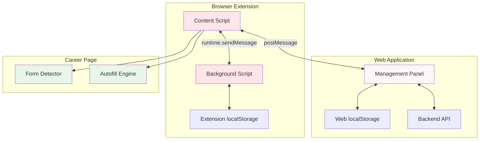

# Design Document: Resume Autofill Extension

## Overview

The Resume Autofill Extension is a Safari-first browser extension that enables one-click autofill of job application forms on company career pages. The extension integrates deeply with the "小小求职拿下" web application through an embedded management panel at the bottom of the main page, rather than a traditional browser toolbar popup.

### Key Architecture Decisions

1. **Safari Extension First**: Phase 1 focuses exclusively on Safari (macOS and iOS), with Edge support planned for Phase 2
2. **Embedded Management UI**: The extension management interface is embedded at the bottom of the web application (below the chat section), not in a browser popup
3. **Dual-Component Architecture**: 
   - **Extension Component**: Runs in the browser (content script + background script) for form detection and autofill
   - **Web Component**: Embedded panel in the web page for resume management, selection, and application tracking
4. **Communication Protocol**: Uses `window.postMessage` for secure bidirectional communication between extension and web page
5. **Data Storage**: Browser localStorage for extension data, synchronized with web application backend
6. **Consistent Theming**: Sakura pink theme matching the existing web application design system

### Design Goals

- **Seamless Integration**: Extension feels like a native part of the web application
- **Privacy-First**: All resume data stored locally in browser, no external transmission except to user's own backend
- **Intelligent Autofill**: Smart field detection and mapping across different company career pages
- **Application Tracking**: Automatic recording and tracking of all job applications
- **Cross-Platform Ready**: Architecture designed for easy expansion to Edge in Phase 2

---

## Architecture

### System Components



### Component Responsibilities

#### 1. Content Script (`content.js`)
- **Lifecycle**: Injected into all web pages (career pages and main application)
- **Responsibilities**:
  - Detect and analyze form fields on career pages
  - Execute autofill operations when triggered
  - Communicate with web page management panel via `window.postMessage`
  - Relay messages between background script and web page
  - Extract company and position information from career pages
- **Permissions Required**: `activeTab`, `scripting`

#### 2. Background Script (`background.js`)
- **Lifecycle**: Persistent service worker
- **Responsibilities**:
  - Manage extension localStorage (resume versions, application records)
  - Handle resume parsing and JSON conversion
  - Coordinate between content scripts on different tabs
  - Provide data synchronization services
  - Handle extension lifecycle events
- **Permissions Required**: `storage`, `unlimitedStorage`

#### 3. Management Panel (Web Component)
- **Location**: Embedded at bottom of main web application, below chat section
- **Responsibilities**:
  - Display all stored resume versions
  - Allow resume upload, naming, and deletion
  - Show active resume selection
  - Display autofill trigger button (enabled only on career pages)
  - Show application tracking dashboard
  - Provide link to detailed tracking page
- **Communication**: Bidirectional with content script via `window.postMessage`

#### 4. Form Detector Module
- **Location**: Within content script
- **Responsibilities**:
  - Scan page DOM for form elements
  - Identify recruitment-related forms
  - Classify field types (text, textarea, select, etc.)
  - Extract field metadata (name, id, placeholder, label, aria-label)
  - Return structured field map to autofill engine

#### 5. Autofill Engine Module
- **Location**: Within content script
- **Responsibilities**:
  - Map resume JSON fields to detected form fields
  - Execute field filling with appropriate data formatting
  - Trigger input events for form validation
  - Handle special field types (dropdowns, textareas)
  - Respect field constraints (maxlength, patterns)
  - Report autofill success/failure status

---

## Components and Interfaces

### Extension Manifest (`manifest.json`)

```json
{
  "manifest_version": 3,
  "name": "小小求职拿下 - 简历自动填充",
  "version": "1.0.0",
  "description": "一键填充公司招聘表单，智能管理投递记录",
  "icons": {
    "16": "icons/icon-16.png",
    "48": "icons/icon-48.png",
    "128": "icons/icon-128.png"
  },
  "permissions": [
    "storage",
    "unlimitedStorage",
    "activeTab",
    "scripting"
  ],
  "host_permissions": [
    "<all_urls>"
  ],
  "background": {
    "service_worker": "background.js",
    "type": "module"
  },
  "content_scripts": [
    {
      "matches": ["<all_urls>"],
      "js": ["content.js"],
      "run_at": "document_idle"
    }
  ],
  "web_accessible_resources": [
    {
      "resources": ["icons/*"],
      "matches": ["<all_urls>"]
    }
  ]
}
```

### Communication Protocol

#### Message Types

**1. Extension → Web Page**

```typescript
// Resume list update
{
  type: 'RESUME_LIST_UPDATE',
  payload: {
    resumes: ResumeVersion[]
  }
}

// Active resume changed
{
  type: 'ACTIVE_RESUME_CHANGED',
  payload: {
    resumeId: string,
    resumeName: string
  }
}

// Form detection result
{
  type: 'FORM_DETECTED',
  payload: {
    detected: boolean,
    fieldCount: number,
    companyName: string,
    positionName: string
  }
}

// Autofill status
{
  type: 'AUTOFILL_STATUS',
  payload: {
    status: 'success' | 'partial' | 'error',
    filledFields: number,
    totalFields: number,
    errors: string[]
  }
}

// Application record created
{
  type: 'APPLICATION_CREATED',
  payload: {
    record: ApplicationRecord
  }
}
```

**2. Web Page → Extension**

```typescript
// Request resume list
{
  type: 'GET_RESUME_LIST',
  payload: {}
}

// Upload new resume
{
  type: 'UPLOAD_RESUME',
  payload: {
    fileName: string,
    fileContent: string, // base64 encoded
    resumeName: string
  }
}

// Select active resume
{
  type: 'SELECT_RESUME',
  payload: {
    resumeId: string
  }
}

// Delete resume
{
  type: 'DELETE_RESUME',
  payload: {
    resumeId: string
  }
}

// Trigger autofill
{
  type: 'TRIGGER_AUTOFILL',
  payload: {
    resumeId: string
  }
}

// Request form detection
{
  type: 'DETECT_FORM',
  payload: {}
}

// Get application records
{
  type: 'GET_APPLICATIONS',
  payload: {
    limit?: number,
    offset?: number
  }
}
```

#### Message Handler Pattern

**Content Script (Receiver)**
```javascript
window.addEventListener('message', (event) => {
  // Verify origin for security
  if (event.origin !== 'https://your-app-domain.com') return;
  
  const { type, payload } = event.data;
  
  switch (type) {
    case 'TRIGGER_AUTOFILL':
      handleAutofill(payload.resumeId);
      break;
    case 'DETECT_FORM':
      handleFormDetection();
      break;
    // ... other cases
  }
});
```

**Web Page (Sender)**
```javascript
window.postMessage({
  type: 'TRIGGER_AUTOFILL',
  payload: { resumeId: 'resume-123' }
}, '*');
```

### API Interfaces

#### Resume Manager API

```typescript
interface ResumeManager {
  // Store a new resume version
  storeResume(resume: ResumeVersion): Promise<string>; // returns resumeId
  
  // Get all stored resumes
  getResumes(): Promise<ResumeVersion[]>;
  
  // Get a specific resume by ID
  getResume(resumeId: string): Promise<ResumeVersion | null>;
  
  // Update resume metadata (name, etc.)
  updateResume(resumeId: string, updates: Partial<ResumeVersion>): Promise<void>;
  
  // Delete a resume
  deleteResume(resumeId: string): Promise<void>;
  
  // Set active resume
  setActiveResume(resumeId: string): Promise<void>;
  
  // Get active resume
  getActiveResume(): Promise<ResumeVersion | null>;
}
```

#### Resume Parser API

```typescript
interface ResumeParser {
  // Parse resume file to JSON
  parseResume(fileContent: string, fileType: 'pdf' | 'docx'): Promise<ResumeJSON>;
  
  // Validate resume JSON structure
  validateResumeJSON(json: ResumeJSON): boolean;
  
  // Extract text from PDF
  extractPDFText(pdfContent: string): Promise<string>;
  
  // Extract text from DOCX
  extractDOCXText(docxContent: string): Promise<string>;
}
```

#### Form Detector API

```typescript
interface FormDetector {
  // Detect forms on current page
  detectForms(): FormDetectionResult;
  
  // Analyze a specific form
  analyzeForm(formElement: HTMLFormElement): FormAnalysis;
  
  // Extract field metadata
  extractFieldMetadata(field: HTMLElement): FieldMetadata;
  
  // Classify field type
  classifyField(field: HTMLElement): FieldType;
}

interface FormDetectionResult {
  detected: boolean;
  forms: FormAnalysis[];
  recruitmentForm: FormAnalysis | null;
}

interface FormAnalysis {
  element: HTMLFormElement;
  fields: FieldMetadata[];
  companyName: string;
  positionName: string;
  confidence: number; // 0-1
}
```

#### Field Mapper API

```typescript
interface FieldMapper {
  // Map resume JSON to form fields
  mapFields(resumeJSON: ResumeJSON, formFields: FieldMetadata[]): FieldMapping[];
  
  // Find best match for a field
  findMatch(field: FieldMetadata, resumeJSON: ResumeJSON): FieldMatch | null;
  
  // Calculate match confidence
  calculateConfidence(fieldName: string, resumeKey: string): number;
}

interface FieldMapping {
  field: FieldMetadata;
  resumeKey: string;
  value: any;
  confidence: number;
}
```

#### Autofill Engine API

```typescript
interface AutofillEngine {
  // Execute autofill operation
  autofill(mappings: FieldMapping[]): Promise<AutofillResult>;
  
  // Fill a single field
  fillField(field: HTMLElement, value: any): Promise<boolean>;
  
  // Trigger input events
  triggerEvents(field: HTMLElement): void;
  
  // Format value for field type
  formatValue(value: any, fieldType: FieldType): string;
}

interface AutofillResult {
  status: 'success' | 'partial' | 'error';
  filledFields: number;
  totalFields: number;
  errors: AutofillError[];
}
```

#### Application Tracker API

```typescript
interface ApplicationTracker {
  // Create new application record
  createRecord(record: Omit<ApplicationRecord, 'id' | 'timestamp'>): Promise<string>;
  
  // Get all application records
  getRecords(options?: QueryOptions): Promise<ApplicationRecord[]>;
  
  // Update record status
  updateStatus(recordId: string, status: ApplicationStatus): Promise<void>;
  
  // Delete record
  deleteRecord(recordId: string): Promise<void>;
  
  // Get statistics
  getStats(): Promise<ApplicationStats>;
}

interface QueryOptions {
  limit?: number;
  offset?: number;
  sortBy?: 'timestamp' | 'company' | 'status';
  sortOrder?: 'asc' | 'desc';
  status?: ApplicationStatus;
}
```

---

## Data Models

### Resume Version

```typescript
interface ResumeVersion {
  id: string;                    // UUID
  name: string;                  // User-assigned name
  fileName: string;              // Original file name
  createdAt: number;             // Unix timestamp
  updatedAt: number;             // Unix timestamp
  data: ResumeJSON;              // Structured resume data
  encrypted: boolean;            // Whether sensitive fields are encrypted
}
```

### Resume JSON Schema

```typescript
interface ResumeJSON {
  personalInfo: {
    name: string;
    phone: string;               // Encrypted
    email: string;               // Encrypted
    address?: string;
    linkedin?: string;
    github?: string;
    portfolio?: string;
  };
  
  education: EducationEntry[];
  
  workExperience: WorkEntry[];
  
  projects: ProjectEntry[];
  
  skills: {
    technical: string[];
    languages: string[];
    certifications: string[];
  };
  
  summary?: string;
  
  customFields?: Record<string, any>;
}

interface EducationEntry {
  institution: string;
  degree: string;
  major: string;
  startDate: string;             // YYYY-MM format
  endDate: string;               // YYYY-MM format or "Present"
  gpa?: string;
  achievements?: string[];
}

interface WorkEntry {
  company: string;
  position: string;
  startDate: string;             // YYYY-MM format
  endDate: string;               // YYYY-MM format or "Present"
  location?: string;
  responsibilities: string[];
  achievements?: string[];
}

interface ProjectEntry {
  name: string;
  description: string;
  role: string;
  startDate?: string;
  endDate?: string;
  technologies: string[];
  highlights: string[];
  url?: string;
}
```

### Application Record

```typescript
interface ApplicationRecord {
  id: string;                    // UUID
  resumeId: string;              // Reference to ResumeVersion
  resumeName: string;            // Snapshot of resume name
  companyName: string;
  positionName: string;
  url: string;                   // Career page URL
  timestamp: number;             // Unix timestamp
  status: ApplicationStatus;
  notes?: string;
  followUpDate?: number;         // Unix timestamp
  
  // Autofill metadata
  autofillSuccess: boolean;
  filledFields: number;
  totalFields: number;
}

type ApplicationStatus = 
  | '已投递'
  | '已查看'
  | '待面试'
  | '已面试'
  | '已拒绝'
  | '已接受';
```

### Field Metadata

```typescript
interface FieldMetadata {
  element: HTMLElement;
  type: FieldType;
  name: string;
  id: string;
  placeholder: string;
  label: string;
  ariaLabel: string;
  required: boolean;
  maxLength?: number;
  pattern?: string;
  options?: string[];            // For select/radio fields
}

type FieldType = 
  | 'text'
  | 'email'
  | 'tel'
  | 'textarea'
  | 'select'
  | 'radio'
  | 'checkbox'
  | 'file'
  | 'date'
  | 'url';
```

### Field Mapping Dictionary

```typescript
const FIELD_MAPPING_DICT: Record<string, string[]> = {
  'personalInfo.name': [
    'name', '姓名', 'full name', 'fullname', 'full_name',
    'applicant name', 'your name', 'candidate name'
  ],
  'personalInfo.phone': [
    'phone', '电话', 'mobile', '手机', 'telephone', 'tel',
    'phone number', 'mobile number', 'contact number'
  ],
  'personalInfo.email': [
    'email', '邮箱', 'e-mail', 'email address', 'mail',
    'contact email', 'your email'
  ],
  'personalInfo.address': [
    'address', '地址', 'location', 'residence', 'city',
    'current location', 'home address'
  ],
  'education[0].institution': [
    'school', '学校', 'university', '大学', 'college', 'institution',
    'education institution', 'alma mater'
  ],
  'education[0].degree': [
    'degree', '学位', 'education level', '学历', 'qualification',
    'highest degree', 'education degree'
  ],
  'education[0].major': [
    'major', '专业', 'field of study', 'specialization', 'discipline',
    'area of study', 'course'
  ],
  'workExperience[0].company': [
    'company', '公司', 'employer', 'organization', 'workplace',
    'current company', 'previous company', 'last employer'
  ],
  'workExperience[0].position': [
    'position', '职位', 'title', 'job title', 'role', 'designation',
    'current position', 'job role'
  ],
  'skills.technical': [
    'skills', '技能', 'technical skills', 'expertise', 'competencies',
    'core skills', 'key skills', 'professional skills'
  ],
  'summary': [
    'summary', '简介', 'about', 'bio', 'introduction', 'profile',
    'personal statement', 'objective', 'career summary'
  ]
};
```

---

## Correctness Properties

*A property is a characteristic or behavior that should hold true across all valid executions of a system—essentially, a formal statement about what the system should do. Properties serve as the bridge between human-readable specifications and machine-verifiable correctness guarantees.*

Before writing correctness properties, I need to analyze the acceptance criteria to determine which are suitable for property-based testing.


### Property Reflection

After analyzing all acceptance criteria, I've identified the following property-based testing opportunities. Here's the reflection to eliminate redundancy:

**Redundancy Analysis:**

1. **Resume Storage Properties (1.1, 1.3, 1.4, 1.5, 1.6)**: These can be consolidated into comprehensive CRUD properties
   - Property 1 will cover storage capacity and retrieval completeness
   - Property 2 will cover unique ID assignment
   - Property 3 will cover name preservation
   - Property 4 will cover deletion correctness

2. **Resume Parsing Properties (2.1, 2.5, 2.6, 12.1, 12.3, 12.4, 12.5)**: The round-trip property (12.4) subsumes most parsing correctness checks
   - Property 5 will be the comprehensive round-trip property
   - Property 6 will cover empty field handling (12.6)
   - Property 7 will cover missing field handling (2.2)

3. **Validation Properties (2.7, 2.8)**: These are distinct and should remain separate
   - Property 8 for email validation
   - Property 9 for phone normalization

4. **Form Detection Properties (3.2, 3.4, 3.5)**: These can be consolidated
   - Property 10 will cover field metadata extraction and type classification

5. **Field Mapping Properties (4.2-4.6, 4.7, 4.8)**: These can be consolidated
   - Property 11 will cover keyword-based mapping
   - Property 12 will cover unmapped field handling

6. **Autofill Properties (5.1, 5.2, 5.3, 5.4, 5.5, 5.7, 5.8)**: These can be consolidated
   - Property 13 will cover field filling correctness
   - Property 14 will cover constraint handling (maxlength, etc.)
   - Property 15 will cover safety (no auto-submit)

7. **Application Tracking Properties (6.1, 6.4, 6.5, 6.6, 6.7)**: These can be consolidated
   - Property 16 will cover record creation and storage
   - Property 17 will cover sorting

8. **Sync Properties (7.4, 7.5, 7.6)**: These can be consolidated
   - Property 18 will cover display completeness
   - Property 19 will cover bidirectional sync with conflict resolution

### Correctness Properties

### Property 1: Resume Storage and Retrieval Completeness

*For any* set of up to 10 resume versions, storing them in the Resume_Manager and then retrieving all resumes SHALL return exactly the same set with all metadata preserved.

**Validates: Requirements 1.1, 1.5**

### Property 2: Unique Resume Identifiers

*For any* set of resume versions created by the Resume_Manager, all assigned identifiers SHALL be unique and all SHALL have valid timestamps within a reasonable range of creation time.

**Validates: Requirements 1.3**

### Property 3: Resume Name Preservation

*For any* resume version and any valid name string, storing the resume with that name and then retrieving it SHALL return the exact same name.

**Validates: Requirements 1.4**

### Property 4: Resume Deletion Correctness

*For any* set of stored resume versions, deleting one specific resume SHALL make that resume unretrievable while all other resumes remain accessible and unchanged.

**Validates: Requirements 1.6**

### Property 5: Resume Parsing Round-Trip

*For any* valid Resume_Version JSON object, printing it to human-readable format and then parsing it back SHALL produce an equivalent JSON object with all fields preserved including multi-line text, special characters, and nested structures.

**Validates: Requirements 2.1, 2.5, 2.6, 12.1, 12.3, 12.4, 12.5**

### Property 6: Empty Field Omission

*For any* Resume_Version JSON object containing empty fields, the printed output SHALL omit those empty fields rather than displaying empty values.

**Validates: Requirements 12.6**

### Property 7: Missing Field Handling

*For any* resume file with missing or ambiguous fields, the Resume_Parser SHALL mark those fields as empty in the output JSON rather than generating incorrect or hallucinated data.

**Validates: Requirements 2.2**

### Property 8: Email Validation

*For any* string that conforms to standard email format patterns (RFC 5322), the Resume_Parser SHALL accept it as valid, and *for any* string that does not conform, the parser SHALL reject it.

**Validates: Requirements 2.7**

### Property 9: Phone Number Normalization

*For any* valid phone number in any common format (with or without country code, with various separators), the Resume_Parser SHALL normalize it to a consistent format, and multiple representations of the same number SHALL normalize to the same output.

**Validates: Requirements 2.8**

### Property 10: Form Field Detection and Classification

*For any* HTML form element with identifying attributes (name, id, placeholder, label, aria-label), the Form_Detector SHALL extract all present attributes, and *for any* element of a known input type (text, textarea, select, radio, checkbox, file), the detector SHALL correctly classify its type, defaulting to text input for unrecognizable types.

**Validates: Requirements 3.2, 3.4, 3.5**

### Property 11: Field Mapping by Keywords

*For any* form field name containing a known keyword from the mapping dictionary (e.g., "name", "phone", "email", "education", "experience"), the Field_Mapper SHALL map it to the corresponding Resume_Version JSON field with confidence >= 70%.

**Validates: Requirements 4.2, 4.3, 4.4, 4.5, 4.6, 4.8**

### Property 12: Unmapped Field Handling

*For any* form field name that does not contain any known keywords and has no fuzzy match with confidence >= 70%, the Field_Mapper SHALL mark it as unmapped and exclude it from autofill operations.

**Validates: Requirements 4.7**

### Property 13: Autofill Field Filling Correctness

*For any* set of mapped form fields and corresponding resume data, the Autofill_Engine SHALL fill all mapped fields with the correct values, trigger appropriate input events on each filled field, and handle special field types (select dropdowns, textareas) with appropriate formatting.

**Validates: Requirements 5.1, 5.2, 5.3, 5.4**

### Property 14: Field Constraint Handling

*For any* form field with a maximum length constraint and resume data exceeding that length, the Autofill_Engine SHALL truncate the content to exactly the maximum length while preserving as much information as possible.

**Validates: Requirements 5.5**

### Property 15: Autofill Safety Constraint

*For any* autofill operation on any form, the Autofill_Engine SHALL NOT trigger form submission automatically, regardless of autofill success or failure.

**Validates: Requirements 5.8**

### Property 16: Application Record Creation and Storage

*For any* completed autofill operation on a career page, the Application_Tracker SHALL create exactly one Application_Record with initial status "已投递", a valid timestamp within reasonable range of current time, and the record SHALL be retrievable from browser local storage.

**Validates: Requirements 6.1, 6.4, 6.5, 6.6**

### Property 17: Application Record Sorting

*For any* set of application records with different timestamps, retrieving all records SHALL return them sorted in descending order by application time (most recent first).

**Validates: Requirements 6.7**

### Property 18: Application Record Display Completeness

*For any* application record, the rendered display output SHALL contain all required fields: company name, position name, application time, and status.

**Validates: Requirements 7.4**

### Property 19: Bidirectional Sync with Conflict Resolution

*For any* application record status update in the Web_Application, the corresponding record in Extension storage SHALL be updated to match, and *for any* conflicting updates with different timestamps, the update with the most recent timestamp SHALL take precedence.

**Validates: Requirements 7.5, 7.6**

---

## Error Handling

### Error Categories

#### 1. Resume Parsing Errors

**Scenarios:**
- Invalid file format (not PDF or DOCX)
- Corrupted file content
- Unreadable text encoding
- Missing required fields

**Handling:**
```typescript
interface ParsingError {
  type: 'INVALID_FORMAT' | 'CORRUPTED_FILE' | 'ENCODING_ERROR' | 'MISSING_FIELDS';
  message: string;
  details?: any;
}

// Return error instead of throwing
function parseResume(file: File): Result<ResumeJSON, ParsingError> {
  try {
    // parsing logic
  } catch (error) {
    return {
      success: false,
      error: {
        type: 'CORRUPTED_FILE',
        message: '文件损坏，无法解析',
        details: error
      }
    };
  }
}
```

**User Feedback:**
- Display clear error message in management panel
- Suggest corrective actions (e.g., "请上传有效的 PDF 或 DOCX 文件")
- Log detailed error to console for debugging

#### 2. Form Detection Errors

**Scenarios:**
- No forms found on page
- Multiple ambiguous forms
- Form structure changes dynamically
- Fields hidden or disabled

**Handling:**
```typescript
interface DetectionError {
  type: 'NO_FORM_FOUND' | 'AMBIGUOUS_FORMS' | 'DYNAMIC_CONTENT';
  message: string;
  suggestions: string[];
}

// Graceful degradation
function detectForms(): DetectionResult {
  const forms = document.querySelectorAll('form');
  
  if (forms.length === 0) {
    return {
      success: false,
      error: {
        type: 'NO_FORM_FOUND',
        message: '未检测到招聘表单',
        suggestions: ['请确认您在公司招聘页面', '尝试刷新页面']
      }
    };
  }
  
  // ... detection logic
}
```

**User Feedback:**
- Disable autofill button when no form detected
- Show tooltip explaining why autofill is unavailable
- Provide manual field mapping option (future enhancement)

#### 3. Autofill Errors

**Scenarios:**
- Field not found (DOM changed)
- Field is readonly or disabled
- Value doesn't match field constraints
- JavaScript validation fails

**Handling:**
```typescript
interface AutofillError {
  field: string;
  type: 'FIELD_NOT_FOUND' | 'READONLY' | 'VALIDATION_FAILED';
  message: string;
  value?: any;
}

// Partial success handling
async function autofill(mappings: FieldMapping[]): Promise<AutofillResult> {
  const errors: AutofillError[] = [];
  let filledCount = 0;
  
  for (const mapping of mappings) {
    try {
      await fillField(mapping.field, mapping.value);
      filledCount++;
    } catch (error) {
      errors.push({
        field: mapping.field.name,
        type: 'VALIDATION_FAILED',
        message: error.message,
        value: mapping.value
      });
      // Continue with remaining fields
    }
  }
  
  return {
    status: errors.length === 0 ? 'success' : 'partial',
    filledFields: filledCount,
    totalFields: mappings.length,
    errors
  };
}
```

**User Feedback:**
- Show success notification with count of filled fields
- If partial success, show warning with unfilled field count
- Provide detailed error log in console
- Highlight unfilled fields visually (future enhancement)

#### 4. Storage Errors

**Scenarios:**
- localStorage quota exceeded
- localStorage disabled (private browsing)
- Data corruption
- Concurrent access conflicts

**Handling:**
```typescript
interface StorageError {
  type: 'QUOTA_EXCEEDED' | 'STORAGE_DISABLED' | 'CORRUPTION' | 'CONFLICT';
  message: string;
  recoverable: boolean;
}

// Retry logic with exponential backoff
async function storeResume(resume: ResumeVersion): Promise<Result<string, StorageError>> {
  try {
    const data = JSON.stringify(resume);
    localStorage.setItem(`resume_${resume.id}`, data);
    return { success: true, value: resume.id };
  } catch (error) {
    if (error.name === 'QuotaExceededError') {
      return {
        success: false,
        error: {
          type: 'QUOTA_EXCEEDED',
          message: '存储空间不足，请删除一些旧简历',
          recoverable: true
        }
      };
    }
    // ... handle other errors
  }
}
```

**User Feedback:**
- Show error notification with specific issue
- Suggest corrective actions (delete old resumes, enable storage)
- Provide export option to save data externally

#### 5. Sync Errors

**Scenarios:**
- Network failure
- Backend API error
- Authentication expired
- Data format mismatch

**Handling:**
```typescript
interface SyncError {
  type: 'NETWORK' | 'API_ERROR' | 'AUTH_EXPIRED' | 'FORMAT_MISMATCH';
  message: string;
  retryable: boolean;
  retryAfter?: number;
}

// Retry with exponential backoff
async function syncToBackend(records: ApplicationRecord[]): Promise<Result<void, SyncError>> {
  const maxRetries = 3;
  let attempt = 0;
  
  while (attempt < maxRetries) {
    try {
      await fetch('/api/applications/sync', {
        method: 'POST',
        body: JSON.stringify(records),
        headers: { 'Content-Type': 'application/json' }
      });
      return { success: true };
    } catch (error) {
      attempt++;
      if (attempt < maxRetries) {
        await sleep(Math.pow(2, attempt) * 1000); // Exponential backoff
      }
    }
  }
  
  return {
    success: false,
    error: {
      type: 'NETWORK',
      message: '同步失败，将在后台重试',
      retryable: true,
      retryAfter: 60000 // 1 minute
    }
  };
}
```

**User Feedback:**
- Show subtle notification for sync failures
- Indicate sync status in management panel
- Queue failed syncs for background retry
- Don't block user workflow

### Error Logging Strategy

```typescript
interface ErrorLog {
  timestamp: number;
  component: string;
  errorType: string;
  message: string;
  stack?: string;
  context?: any;
}

class ErrorLogger {
  private logs: ErrorLog[] = [];
  private maxLogs = 100;
  
  log(component: string, error: Error, context?: any) {
    const log: ErrorLog = {
      timestamp: Date.now(),
      component,
      errorType: error.name,
      message: error.message,
      stack: error.stack,
      context
    };
    
    this.logs.push(log);
    if (this.logs.length > this.maxLogs) {
      this.logs.shift(); // Keep only recent logs
    }
    
    // Log to console in development
    if (process.env.NODE_ENV === 'development') {
      console.error(`[${component}]`, error, context);
    }
  }
  
  getLogs(): ErrorLog[] {
    return [...this.logs];
  }
  
  exportLogs(): string {
    return JSON.stringify(this.logs, null, 2);
  }
}
```

---

## Testing Strategy

### Testing Approach

This feature requires a **dual testing approach** combining property-based testing for core logic and example-based testing for integration points and UI behavior.

#### Property-Based Testing (PBT)

**Applicable Components:**
- Resume Manager (CRUD operations)
- Resume Parser (parsing and printing)
- Field Mapper (keyword matching)
- Autofill Engine (field filling logic)
- Application Tracker (record management)

**PBT Library:** [fast-check](https://github.com/dubzzz/fast-check) for JavaScript/TypeScript

**Configuration:**
- Minimum 100 iterations per property test
- Each test tagged with reference to design property
- Tag format: `Feature: resume-autofill-extension, Property {number}: {property_text}`

**Example Property Test:**

```typescript
import fc from 'fast-check';

describe('Property 5: Resume Parsing Round-Trip', () => {
  it('should preserve all data through print-parse cycle', () => {
    // Feature: resume-autofill-extension, Property 5: Resume Parsing Round-Trip
    fc.assert(
      fc.property(
        resumeJSONArbitrary(), // Generator for valid resume JSON
        (originalResume) => {
          const printed = resumePrinter.print(originalResume);
          const parsed = resumeParser.parse(printed);
          
          // Deep equality check
          expect(parsed).toEqual(originalResume);
        }
      ),
      { numRuns: 100 }
    );
  });
});

// Generator for resume JSON
function resumeJSONArbitrary(): fc.Arbitrary<ResumeJSON> {
  return fc.record({
    personalInfo: fc.record({
      name: fc.string({ minLength: 1, maxLength: 100 }),
      phone: fc.string({ minLength: 10, maxLength: 15 }),
      email: fc.emailAddress(),
      address: fc.option(fc.string()),
      linkedin: fc.option(fc.webUrl()),
      github: fc.option(fc.webUrl()),
      portfolio: fc.option(fc.webUrl())
    }),
    education: fc.array(educationEntryArbitrary(), { minLength: 0, maxLength: 5 }),
    workExperience: fc.array(workEntryArbitrary(), { minLength: 0, maxLength: 10 }),
    projects: fc.array(projectEntryArbitrary(), { minLength: 0, maxLength: 10 }),
    skills: fc.record({
      technical: fc.array(fc.string(), { maxLength: 20 }),
      languages: fc.array(fc.string(), { maxLength: 10 }),
      certifications: fc.array(fc.string(), { maxLength: 10 })
    }),
    summary: fc.option(fc.string({ maxLength: 500 }))
  });
}
```

#### Unit Testing

**Applicable Components:**
- Form Detector (specific form patterns)
- Field Mapper (specific keyword examples)
- Error handlers (specific error scenarios)
- UI components (specific interactions)

**Test Framework:** Jest + Testing Library

**Example Unit Test:**

```typescript
describe('Form Detector', () => {
  it('should detect recruitment form among multiple forms', () => {
    const html = `
      <form id="search">
        <input name="query" />
      </form>
      <form id="application">
        <input name="full_name" />
        <input name="email" />
        <input name="resume" type="file" />
      </form>
    `;
    document.body.innerHTML = html;
    
    const result = formDetector.detectForms();
    
    expect(result.detected).toBe(true);
    expect(result.recruitmentForm?.element.id).toBe('application');
    expect(result.recruitmentForm?.fields.length).toBe(3);
  });
  
  it('should return no form when only search box exists', () => {
    const html = `<form id="search"><input name="query" /></form>`;
    document.body.innerHTML = html;
    
    const result = formDetector.detectForms();
    
    expect(result.detected).toBe(false);
    expect(result.recruitmentForm).toBeNull();
  });
});
```

#### Integration Testing

**Applicable Components:**
- Extension ↔ Web Page communication (postMessage)
- Extension ↔ Backend API sync
- Browser storage operations
- Cross-browser compatibility

**Test Framework:** Playwright for end-to-end testing

**Example Integration Test:**

```typescript
import { test, expect } from '@playwright/test';

test.describe('Extension Integration', () => {
  test('should communicate between extension and web page', async ({ page, context }) => {
    // Load extension
    const extensionPath = './dist/extension';
    const extensionContext = await context.addExtension(extensionPath);
    
    // Navigate to web application
    await page.goto('https://your-app.com');
    
    // Upload resume in management panel
    await page.click('[data-testid="upload-resume"]');
    await page.setInputFiles('input[type="file"]', './test-resume.pdf');
    await page.fill('[data-testid="resume-name"]', 'Software Engineer Resume');
    await page.click('[data-testid="save-resume"]');
    
    // Verify resume appears in list
    await expect(page.locator('[data-testid="resume-list"]')).toContainText('Software Engineer Resume');
    
    // Navigate to career page
    await page.goto('https://example-company.com/careers/software-engineer');
    
    // Verify form detected
    await expect(page.locator('[data-testid="autofill-button"]')).toBeEnabled();
    
    // Trigger autofill
    await page.click('[data-testid="autofill-button"]');
    
    // Verify fields filled
    await expect(page.locator('input[name="name"]')).toHaveValue('John Doe');
    await expect(page.locator('input[name="email"]')).toHaveValue('john@example.com');
    
    // Verify application record created
    await page.goto('https://your-app.com');
    await expect(page.locator('[data-testid="application-list"]')).toContainText('Example Company');
  });
});
```

#### Manual Testing Checklist

**Safari Extension (Phase 1):**
- [ ] Extension installs successfully on Safari macOS
- [ ] Extension installs successfully on Safari iOS
- [ ] Management panel renders correctly in web application
- [ ] Resume upload works with PDF files
- [ ] Resume upload works with DOCX files
- [ ] Form detection works on major job boards (LinkedIn, Indeed, Glassdoor)
- [ ] Form detection works on company career pages (sample 10 companies)
- [ ] Autofill correctly fills all detected fields
- [ ] Autofill handles special characters in resume data
- [ ] Application tracking records all autofill operations
- [ ] Sync works between extension and web application
- [ ] Extension respects Safari's privacy settings
- [ ] Extension works in Safari private browsing mode
- [ ] UI matches sakura pink theme
- [ ] All error messages display correctly

**Edge Extension (Phase 2):**
- [ ] Extension installs successfully on Edge
- [ ] All Safari functionality works identically on Edge
- [ ] Edge-specific APIs work correctly
- [ ] Extension manifest compatible with Edge

### Test Coverage Goals

- **Property Tests**: 100% coverage of core business logic
- **Unit Tests**: 90% coverage of utility functions and modules
- **Integration Tests**: Critical user flows (upload → autofill → track)
- **Manual Tests**: Cross-browser compatibility and UI/UX

### Continuous Testing

```yaml
# .github/workflows/test.yml
name: Test Extension

on: [push, pull_request]

jobs:
  property-tests:
    runs-on: ubuntu-latest
    steps:
      - uses: actions/checkout@v3
      - uses: actions/setup-node@v3
      - run: npm install
      - run: npm run test:property
      
  unit-tests:
    runs-on: ubuntu-latest
    steps:
      - uses: actions/checkout@v3
      - uses: actions/setup-node@v3
      - run: npm install
      - run: npm run test:unit
      
  integration-tests:
    runs-on: ubuntu-latest
    steps:
      - uses: actions/checkout@v3
      - uses: actions/setup-node@v3
      - run: npm install
      - run: npx playwright install
      - run: npm run test:integration
      
  safari-build:
    runs-on: macos-latest
    steps:
      - uses: actions/checkout@v3
      - uses: actions/setup-node@v3
      - run: npm install
      - run: npm run build:safari
      - run: xcrun safari-web-extension-converter dist/extension
```

---

## Implementation Notes

### Phase 1: Safari Extension (Priority)

**Deliverables:**
1. Safari extension with content script and background script
2. Embedded management panel in web application
3. Resume parser supporting PDF and DOCX
4. Form detector and autofill engine
5. Application tracker with localStorage
6. postMessage communication protocol
7. Sakura pink themed UI components

**Timeline Estimate:** 4-6 weeks

### Phase 2: Edge Extension

**Deliverables:**
1. Edge-compatible manifest
2. Edge-specific API adaptations
3. Cross-browser testing suite

**Timeline Estimate:** 1-2 weeks

### Technology Stack

**Extension:**
- TypeScript for type safety
- Webpack for bundling
- pdf.js for PDF parsing
- mammoth.js for DOCX parsing
- fast-check for property-based testing

**Web Application:**
- Existing HTML/CSS/JavaScript stack
- No framework changes required
- Extend existing sakura pink theme

### Security Considerations

1. **Data Encryption**: Encrypt sensitive fields (phone, email) before storing in localStorage
2. **Origin Validation**: Verify message origin in postMessage handlers
3. **Minimal Permissions**: Request only necessary browser permissions
4. **HTTPS Only**: All backend communication over HTTPS
5. **No External Transmission**: Resume data never leaves user's browser except to their own backend
6. **Content Security Policy**: Implement strict CSP in extension

### Performance Considerations

1. **Lazy Loading**: Load resume parser libraries only when needed
2. **Debouncing**: Debounce form detection on dynamic pages
3. **Caching**: Cache parsed resumes to avoid re-parsing
4. **Batch Operations**: Batch localStorage operations to reduce I/O
5. **Background Sync**: Sync application records in background without blocking UI

---

## Future Enhancements

1. **Manual Field Mapping**: Allow users to manually map fields when auto-detection fails
2. **Resume Templates**: Provide templates for different job types
3. **AI-Powered Customization**: Automatically customize resume content based on job description
4. **Cover Letter Generation**: Generate cover letters from resume data
5. **Application Status Tracking**: Integrate with email to track application status updates
6. **Analytics Dashboard**: Show application success rates, response times, etc.
7. **Multi-Language Support**: Support resumes in multiple languages
8. **Chrome Extension**: Expand to Chrome browser (Phase 3)
9. **Firefox Extension**: Expand to Firefox browser (Phase 4)
10. **Mobile App**: Native iOS/Android apps with similar functionality
