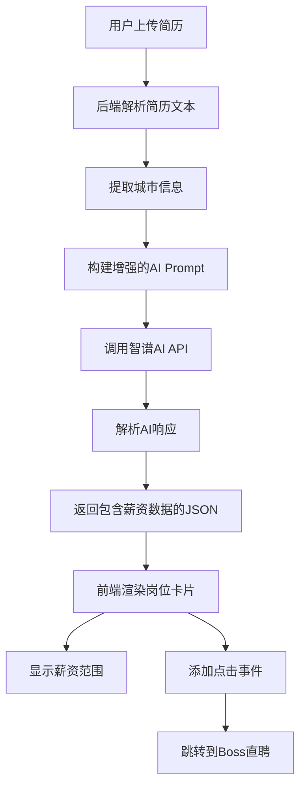

# Design Document: 行业薪资数据参考功能

## Overview

本设计文档描述了简历解析系统中行业薪资数据参考功能的技术实现方案。该功能通过修改AI prompt让智谱AI模型在岗位推荐时生成基于城市的薪资范围数据，并在前端岗位卡片中显示薪资信息，同时支持点击跳转到Boss直聘搜索相关岗位。

### 核心目标

1. **AI驱动的薪资推断**：利用现有的智谱AI GLM-4-Flash模型，在单次API调用中为每个推荐岗位生成合理的薪资范围
2. **城市感知**：从简历中提取城市信息，使薪资数据反映地域差异
3. **无缝集成**：在现有的岗位推荐卡片中自然融入薪资信息，保持UI一致性
4. **外部跳转**：支持点击岗位卡片跳转到Boss直聘，方便用户查看详细职位信息

### 技术约束

- 不引入新的数据库或外部API依赖
- 使用现有的智谱AI模型和API调用流程
- 保持前端设计风格和用户体验的一致性
- 确保功能降级时不影响核心岗位推荐功能

## Architecture

### 系统架构图



### 数据流

1. **上传阶段**：用户上传PDF/DOCX简历 → 后端提取文本
2. **解析阶段**：后端调用`_parse_resume_with_ai()`函数，传入简历文本
3. **AI处理阶段**：
   - 从简历文本中提取城市信息（通过正则表达式或AI推断）
   - 构建包含薪资生成指令的prompt
   - 智谱AI返回包含`salary_range`字段的JSON
4. **响应阶段**：后端返回完整的解析结果给前端
5. **渲染阶段**：前端JavaScript解析JSON，渲染岗位卡片，显示薪资信息
6. **交互阶段**：用户点击卡片 → 在新标签页打开Boss直聘搜索页面

## Components and Interfaces

### 后端组件

#### 1. 城市提取模块

**位置**：`backend/main.py`

**功能**：从简历文本中提取城市信息

**实现方案**：
- **方案A（推荐）**：在AI prompt中要求模型提取城市信息，作为JSON响应的一部分
- **方案B**：使用正则表达式匹配常见城市名称（如：北京、上海、深圳、杭州等）

**接口**：
```python
def _extract_city_from_resume(raw_text: str) -> str:
    """
    从简历文本中提取城市信息
    
    Args:
        raw_text: 简历原始文本
        
    Returns:
        城市名称（如："北京"、"上海"），如果未找到则返回空字符串
    """
    pass
```

#### 2. AI Prompt增强模块

**位置**：`backend/main.py` 中的 `_parse_resume_with_ai()` 函数

**修改内容**：
1. 在prompt中添加城市提取指令
2. 在`job_recommendations`字段说明中添加`salary_range`子字段要求
3. 明确薪资推断规则（基于岗位、行业、城市）

**新增的Prompt片段**：
```
6) city: 字符串，从简历中提取的城市信息（如："北京"、"上海"、"深圳"等）
   如果简历中未明确提及城市，返回空字符串

4) job_recommendations: 数组，推荐6个适合该候选人的岗位，覆盖不同行业，每项包含：
   - title: 岗位名称
   - industry: 所属行业（如：科技、金融、咨询、教育、创业、政府等）
   - reason: 推荐理由（30字以内，结合简历技能和MBTI特质）
   - match_level: 匹配度，"高" 或 "中"
   - salary_range: 对象，包含：
     * min_salary: 整数，最低月薪（单位：千元，如15表示15K）
     * max_salary: 整数，最高月薪（单位：千元，如25表示25K）
     * city: 字符串，薪资对应的城市（使用提取的城市信息，如果为空则使用"全国"）
   
   【薪资推断规则】：
   - 根据岗位名称、行业和城市推断合理的薪资范围
   - 一线城市（北京、上海、深圳、杭州）薪资通常高于二三线城市20-40%
   - 技术岗位（算法、开发）通常高于运营、市场岗位
   - 金融、互联网行业通常高于传统行业
   - 薪资范围应符合2024年市场行情
   - 示例：北京的算法工程师可能是25-40K，而成都可能是18-30K
```

#### 3. JSON响应结构

**新增字段**：
```json
{
  "city": "北京",
  "job_recommendations": [
    {
      "title": "算法工程师",
      "industry": "科技",
      "reason": "技术背景强，适合算法研发",
      "match_level": "高",
      "salary_range": {
        "min_salary": 25,
        "max_salary": 40,
        "city": "北京"
      }
    }
  ]
}
```

### 前端组件

#### 1. 岗位卡片渲染模块

**位置**：`frontend/index.html` 中的JavaScript部分

**修改内容**：
1. 在`renderJobCard()`函数中添加薪资范围显示逻辑
2. 为岗位卡片添加点击事件监听器
3. 构建Boss直聘跳转URL

**新增函数**：
```javascript
function renderJobCard(job) {
  const matchClass = job.match_level === '高' ? 'match-high' : 'match-mid';
  const matchText = job.match_level === '高' ? '高匹配' : '中匹配';
  
  // 构建薪资显示文本
  let salaryHTML = '';
  if (job.salary_range && job.salary_range.min_salary && job.salary_range.max_salary) {
    const salaryText = `${job.salary_range.min_salary}-${job.salary_range.max_salary}K`;
    const cityText = job.salary_range.city || '全国';
    salaryHTML = `
      <div class="job-salary">
        <span class="salary-amount">${salaryText}</span>
        <span class="salary-city">${cityText}</span>
      </div>
    `;
  }
  
  const card = document.createElement('div');
  card.className = 'job-card';
  card.innerHTML = `
    <div class="job-header">
      <div class="job-title">${job.title}</div>
      <span class="match-badge ${matchClass}">${matchText}</span>
    </div>
    <span class="industry-tag">${job.industry}</span>
    ${salaryHTML}
    <div class="job-reason">${job.reason}</div>
  `;
  
  // 添加点击跳转事件
  card.addEventListener('click', () => {
    const city = job.salary_range?.city || '';
    const jobTitle = encodeURIComponent(job.title);
    const cityParam = city ? `&city=${encodeURIComponent(city)}` : '';
    const bossUrl = `https://www.zhipin.com/job_detail/?query=${jobTitle}${cityParam}`;
    window.open(bossUrl, '_blank');
  });
  
  return card;
}
```

#### 2. CSS样式增强

**位置**：`frontend/index.html` 中的`<style>`标签

**新增样式**：
```css
.job-card {
  cursor: pointer; /* 添加指针光标提示可点击 */
}

.job-salary {
  display: flex;
  align-items: center;
  gap: 6px;
  margin: 6px 0;
}

.salary-amount {
  font-size: 14px;
  font-weight: 700;
  color: var(--brand);
  letter-spacing: 0.2px;
}

.salary-city {
  font-size: 10px;
  font-weight: 500;
  color: var(--ink-4);
  background: var(--surface);
  border: 1px solid var(--border);
  border-radius: 4px;
  padding: 2px 6px;
}

.job-card:hover {
  cursor: pointer;
  border-color: var(--brand);
  box-shadow: 0 4px 16px rgba(24,184,154,0.15);
  transform: translateY(-2px);
}

.job-card:active {
  transform: translateY(0);
}
```

## Data Models

### AI响应数据模型

```typescript
interface ResumeAnalysisResponse {
  inferred_mbti: string;
  mbti_description: string;
  candidate_summary: string;
  city: string; // 新增字段
  job_recommendations: JobRecommendation[];
  resume_diagnosis: ResumeDiagnosis;
}

interface JobRecommendation {
  title: string;
  industry: string;
  reason: string;
  match_level: "高" | "中";
  salary_range: SalaryRange; // 新增字段
}

interface SalaryRange {
  min_salary: number; // 单位：千元（K）
  max_salary: number; // 单位：千元（K）
  city: string; // 城市名称
}
```

### Boss直聘URL构建规则

**基础URL**：`https://www.zhipin.com/job_detail/`

**查询参数**：
- `query`: 岗位名称（URL编码）
- `city`: 城市名称（可选，URL编码）

**示例**：
- 北京的算法工程师：`https://www.zhipin.com/job_detail/?query=%E7%AE%97%E6%B3%95%E5%B7%A5%E7%A8%8B%E5%B8%88&city=%E5%8C%97%E4%BA%AC`
- 无城市限制的产品经理：`https://www.zhipin.com/job_detail/?query=%E4%BA%A7%E5%93%81%E7%BB%8F%E7%90%86`

## Error Handling

### 后端错误处理

#### 1. AI响应解析失败

**场景**：智谱AI返回的JSON格式不正确或缺少`salary_range`字段

**处理策略**：
```python
def _to_json_with_fallback(content: str) -> dict[str, Any]:
    try:
        data = json.loads(content)
        
        # 验证并补充缺失的salary_range字段
        if "job_recommendations" in data:
            for job in data["job_recommendations"]:
                if "salary_range" not in job:
                    # 提供默认值或省略该字段
                    job["salary_range"] = None
        
        return data
    except json.JSONDecodeError:
        # 现有的fallback逻辑
        return _fallback_parse(content)
```

#### 2. 城市提取失败

**场景**：简历中未明确提及城市信息

**处理策略**：
- 返回空字符串`""`
- AI模型使用"全国"作为默认城市
- 薪资范围基于全国平均水平推断

### 前端错误处理

#### 1. 薪资数据缺失

**场景**：后端响应中某些岗位缺少`salary_range`字段

**处理策略**：
```javascript
function renderJobCard(job) {
  // 检查salary_range是否存在
  let salaryHTML = '';
  if (job.salary_range && 
      job.salary_range.min_salary && 
      job.salary_range.max_salary) {
    // 渲染薪资信息
    salaryHTML = `...`;
  }
  // 如果不存在，不显示薪资信息，其他内容正常显示
}
```

#### 2. 跳转URL构建失败

**场景**：岗位标题包含特殊字符或城市信息异常

**处理策略**：
```javascript
card.addEventListener('click', () => {
  try {
    const jobTitle = encodeURIComponent(job.title || '');
    const city = job.salary_range?.city || '';
    const cityParam = city ? `&city=${encodeURIComponent(city)}` : '';
    const bossUrl = `https://www.zhipin.com/job_detail/?query=${jobTitle}${cityParam}`;
    window.open(bossUrl, '_blank');
  } catch (error) {
    console.error('Failed to open job portal:', error);
    // 降级：使用不带城市参数的URL
    const fallbackUrl = `https://www.zhipin.com/job_detail/?query=${encodeURIComponent(job.title)}`;
    window.open(fallbackUrl, '_blank');
  }
});
```

#### 3. 浏览器阻止弹窗

**场景**：浏览器的弹窗阻止器可能阻止`window.open()`

**处理策略**：
- 使用`target="_blank"`的`<a>`标签代替`window.open()`
- 或者在控制台提示用户允许弹窗

## Testing Strategy

### 单元测试

#### 后端测试

1. **城市提取测试**
   - 测试包含明确城市信息的简历（如："北京市朝阳区"）
   - 测试不包含城市信息的简历
   - 测试包含多个城市的简历（取第一个）

2. **AI Prompt测试**
   - 验证修改后的prompt能够生成包含`salary_range`的响应
   - 测试不同城市的薪资差异是否合理
   - 测试不同行业的薪资差异是否合理

3. **JSON解析测试**
   - 测试完整的JSON响应解析
   - 测试缺少`salary_range`字段的响应
   - 测试`salary_range`字段格式错误的响应

#### 前端测试

1. **薪资显示测试**
   - 测试正常的薪资数据渲染
   - 测试缺少薪资数据时的降级显示
   - 测试不同薪资范围的格式化（如：15-25K、30-50K）

2. **跳转功能测试**
   - 测试点击卡片是否正确打开新标签页
   - 测试URL参数是否正确编码
   - 测试带城市参数和不带城市参数的URL

3. **样式测试**
   - 测试薪资信息在不同屏幕尺寸下的显示
   - 测试悬停效果和点击反馈
   - 测试与现有设计的一致性

### 集成测试

1. **端到端测试**
   - 上传包含城市信息的简历 → 验证岗位卡片显示对应城市的薪资
   - 上传不包含城市信息的简历 → 验证岗位卡片显示全国薪资
   - 点击岗位卡片 → 验证Boss直聘页面正确打开

2. **AI模型测试**
   - 使用真实简历测试AI生成的薪资范围是否合理
   - 测试不同MBTI类型和技能背景的简历，验证岗位推荐和薪资的一致性

### 手动测试清单

- [ ] 上传简历后，所有6个岗位卡片都显示薪资范围
- [ ] 薪资范围格式正确（如：15-25K）
- [ ] 城市标签正确显示（如：北京、上海）
- [ ] 点击岗位卡片能在新标签页打开Boss直聘
- [ ] Boss直聘搜索页面显示相关岗位
- [ ] 薪资信息与现有UI风格一致
- [ ] 移动端显示正常
- [ ] 当AI未返回薪资数据时，岗位卡片仍正常显示其他信息

### 测试数据

**测试简历示例**：

1. **包含城市的简历**：
```
张三
联系方式：138****1234
邮箱：zhangsan@example.com
地址：北京市朝阳区

教育背景：
清华大学 计算机科学与技术 本科 2020-2024

工作经历：
字节跳动 算法工程师实习生 2023.06-2023.12
- 负责推荐系统算法优化
- 使用Python、TensorFlow进行模型训练
```

2. **不包含城市的简历**：
```
李四
联系方式：139****5678
邮箱：lisi@example.com

教育背景：
浙江大学 软件工程 硕士 2022-2025

项目经历：
电商推荐系统
- 使用协同过滤算法实现商品推荐
- 技术栈：Python、Django、Redis
```

**预期输出**：

简历1（北京）的算法工程师岗位：
```json
{
  "title": "算法工程师",
  "industry": "科技",
  "salary_range": {
    "min_salary": 25,
    "max_salary": 40,
    "city": "北京"
  }
}
```

简历2（无城市）的算法工程师岗位：
```json
{
  "title": "算法工程师",
  "industry": "科技",
  "salary_range": {
    "min_salary": 20,
    "max_salary": 35,
    "city": "全国"
  }
}
```

## Implementation Notes

### 开发优先级

1. **Phase 1：后端AI Prompt修改**（高优先级）
   - 修改`_parse_resume_with_ai()`函数中的prompt
   - 添加城市提取和薪资生成指令
   - 测试AI响应格式

2. **Phase 2：前端显示薪资**（高优先级）
   - 修改岗位卡片渲染逻辑
   - 添加CSS样式
   - 测试不同数据情况下的显示

3. **Phase 3：跳转功能**（中优先级）
   - 添加点击事件监听器
   - 构建Boss直聘URL
   - 测试跳转功能

4. **Phase 4：错误处理和优化**（中优先级）
   - 添加降级逻辑
   - 优化用户体验
   - 完善错误日志

### 技术风险

1. **AI生成的薪资准确性**
   - 风险：AI模型可能生成不合理的薪资范围
   - 缓解：在prompt中提供详细的薪资推断规则和示例
   - 缓解：定期审查AI生成的薪资数据，调整prompt

2. **Boss直聘URL变化**
   - 风险：Boss直聘可能修改URL结构
   - 缓解：使用通用的搜索URL格式
   - 缓解：添加错误处理，当跳转失败时提供备选方案

3. **城市提取准确性**
   - 风险：简历中的城市信息可能不明确或有歧义
   - 缓解：使用AI模型的语义理解能力
   - 缓解：提供默认值（全国）作为fallback

### 性能考虑

1. **API调用延迟**
   - 现状：已经在调用智谱AI API，增加薪资生成不会显著增加延迟
   - 优化：确保在单次API调用中完成所有数据生成

2. **前端渲染性能**
   - 影响：添加薪资信息和点击事件对渲染性能影响极小
   - 优化：使用事件委托减少事件监听器数量（如果需要）

### 可扩展性

1. **支持更多招聘网站**
   - 当前：仅支持Boss直聘
   - 扩展：可以添加拉勾网、智联招聘等其他平台
   - 实现：在前端添加平台选择器，或根据岗位类型自动选择平台

2. **薪资数据来源**
   - 当前：AI推断
   - 扩展：未来可以集成真实的薪资数据API（如：职友集、看准网）
   - 实现：添加数据源配置，优先使用真实数据，fallback到AI推断

3. **城市数据库**
   - 当前：AI提取
   - 扩展：可以建立城市代码映射表，支持更精确的城市匹配
   - 实现：添加城市配置文件，包含城市名称、代码、薪资系数等

## Deployment Considerations

### 环境变量

无需新增环境变量，使用现有的：
- `ZHIPU_API_KEY`：智谱AI API密钥
- `ZHIPU_MODEL`：模型名称（glm-4-flash）

### 数据库迁移

无需数据库迁移，所有数据通过AI实时生成。

### 向后兼容性

- 前端代码兼容不包含`salary_range`字段的旧版API响应
- 后端API响应保持现有字段不变，仅新增字段
- 用户无需更新客户端即可使用新功能

### 监控和日志

建议添加以下日志：
1. 城市提取结果（用于验证准确性）
2. AI生成的薪资范围（用于质量监控）
3. 跳转URL构建失败的错误（用于调试）

示例日志：
```python
logger.info(f"Extracted city: {city} from resume")
logger.info(f"Generated salary range for {job_title}: {min_salary}-{max_salary}K in {city}")
logger.error(f"Failed to build job portal URL: {error}")
```

## Security Considerations

### 数据隐私

- 简历数据仅在内存中处理，不持久化存储
- 跳转到Boss直聘时，仅传递岗位名称和城市，不传递个人信息

### XSS防护

- 前端渲染时使用`textContent`或适当的HTML转义
- 确保AI返回的数据不包含恶意脚本

示例：
```javascript
// 安全的渲染方式
const titleElement = document.createElement('div');
titleElement.textContent = job.title; // 自动转义

// 或使用innerHTML时进行转义
function escapeHtml(text) {
  const div = document.createElement('div');
  div.textContent = text;
  return div.innerHTML;
}
```

### URL注入防护

- 使用`encodeURIComponent()`对URL参数进行编码
- 验证跳转URL的域名（确保是Boss直聘的域名）

示例：
```javascript
function buildJobPortalUrl(jobTitle, city) {
  const baseUrl = 'https://www.zhipin.com/job_detail/';
  const query = encodeURIComponent(jobTitle);
  const cityParam = city ? `&city=${encodeURIComponent(city)}` : '';
  return `${baseUrl}?query=${query}${cityParam}`;
}
```

## Future Enhancements

1. **薪资趋势分析**
   - 显示该岗位的薪资增长趋势
   - 对比不同城市的薪资差异

2. **个性化薪资推荐**
   - 根据用户的工作年限、技能水平调整薪资范围
   - 显示用户在该岗位的薪资竞争力

3. **多平台支持**
   - 支持拉勾网、智联招聘、猎聘等多个招聘平台
   - 用户可选择偏好的招聘平台

4. **薪资数据可视化**
   - 使用图表展示薪资分布
   - 对比不同岗位的薪资水平

5. **实时薪资数据**
   - 集成第三方薪资数据API
   - 提供更准确的市场薪资信息

---

**文档版本**：1.0  
**最后更新**：2025-01-XX  
**作者**：Kiro AI Agent
